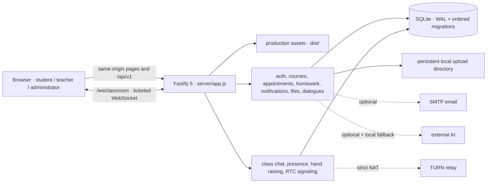

<a id="readme-top"></a>

<div align="center">
  

  <h1>International Chinese Platform</h1>

  <p><strong>A self-contained, full-stack teaching workspace for international Chinese education</strong></p>
  <p>Student learning, teacher delivery, and platform review in one runnable, testable, deployable workflow.</p>

  <p>
    <a href="#overview"><strong>Overview</strong></a>
    ·
    <a href="#completeness"><strong>Completeness</strong></a>
    ·
    <a href="#quick-start"><strong>Quick Start</strong></a>
    ·
    <a href="#documentation"><strong>Documentation</strong></a>
    ·
    <a href="./README.md"><strong>中文</strong></a>
  </p>

  <p>
    <a href="https://github.com/computersciencefreshmen/International_Chinese_Platform/actions/workflows/ci.yml">
      
    </a>
    
    
    
    
    
    
    
  </p>
</div>

---

<a id="overview"></a>

## Overview

International Chinese Platform is a modular monolith built around real teaching collaboration. Its Vue 3 client, Fastify API, SQLite persistence, file service, and real-time classroom protocol all live in this repository. The backend is in [`server/`](./server/), and [`server/app.js`](./server/app.js) registers every domain route. No unknown or obsolete backend from an earlier repository is required.

The product contains separate student, teacher, and administrator workspaces. Course moderation, teacher appointments, and homework grading move between those roles through database-backed workflows. Notifications and audit records are persisted with business transitions instead of being simulated in the browser.

> [!NOTE]
> In this repository, “complete” means that the core teaching workflows can be installed, migrated, started, demonstrated, tested, backed up, and restored within a single-instance deployment boundary. It does not claim to be a commercial LMS with payments, formal enrollment, lesson recording, or unlimited horizontal scaling. No hosted demo or screenshots are invented here.

### Portfolio Highlights

- **More than a frontend shell** — Authentication, authorization, domain APIs, migrations, demo data, uploads, email integration, WebSockets, tests, and a production container are maintained together.
- **Explicit workflow state machines** — A rejected course can be revised and resubmitted; an accepted appointment creates a classroom after conflict checks; homework moves from draft through submission to grading under server-side rules.
- **Consistent cross-role data** — Students, teachers, and administrators operate on the same SQLite records. Notifications, review history, and important audit events are written with state changes.
- **Explainable security defaults** — Server-side opaque sessions, HttpOnly cookies, scrypt password hashing, origin checks, role and ownership checks, rate limiting, and file-signature validation are built in.
- **Bounded external dependencies** — SMTP, AI, and TURN are adapters. If external AI is absent or fails, a deterministic local dialogue provider keeps the teaching flow usable.
- **Operationally inspectable** — Ordered migrations, one-time administrator bootstrap, a multi-stage Docker image, health probes, persistent volumes, backup instructions, and recovery procedures are included.

<a id="completeness"></a>

## Completeness Definition

| Category                    | Status             | Repository commitment                                                                                                                                                                                                  |
| --------------------------- | ------------------ | ---------------------------------------------------------------------------------------------------------------------------------------------------------------------------------------------------------------------- |
| Core teaching domain        | ✅ Complete        | Three-role authentication and authorization, teacher verification, course review, appointments and classrooms, homework grading, notifications, profiles, files, and dialogues have frontend, backend, and persistence |
| Engineering and operations  | ✅ Complete        | Reproducible installation, automatic migrations, demo data, API tests, production build, CI, Docker Compose, health checks, admin bootstrap, and backup/recovery guidance                                              |
| SMTP email                  | ◇ Conditional      | Local development can return a development verification code; enabling production registration requires `SMTP_URL`, `MAIL_FROM`, and a stable verification secret                                                      |
| AI dialogue                 | ◇ Optional adapter | A compatible external JSON API may be configured; timeout, failure, or no configuration falls back to deterministic local teaching dialogue                                                                            |
| TURN relay                  | ◇ Conditional      | WebRTC can work when peers are directly reachable; strict NAT, enterprise networks, and dependable production classrooms require TURN                                                                                  |
| Commercial LMS capabilities | — Out of scope     | Payments, formal enrollment and capacity allocation, issuer-backed certificate verification/OCR, classroom recording, content-rights workflows, and multi-node WebSockets are not implemented                          |

Price and capacity are informational course fields; they do not represent payment or seat allocation. Until a formal enrollment model is added, assignments for published courses are visible and submittable by every authenticated student. The SQLite topology is intentionally one process and one application replica. Horizontal scaling first requires a new persistence layer and a distributed room-coordination design.

## Role Workspaces

### Student

- Register, sign in, restore a session, update a profile, and change a password.
- Discover published courses and professional profiles for platform-verified teachers, create or cancel an appointment, and receive state notifications.
- Enter a classroom during its join window, use chat, hand raising, and WebRTC audio/video signaling, and confirm classroom completion.
- View published assignments, save server-side drafts, submit answers, and read teacher scores and feedback.
- Create persistent Chinese dialogue exercises; local teaching feedback remains available without external AI.
- Follow notification deep links back to the relevant appointment, classroom, or assignment context.

### Teacher

- Maintain school, title, experience, specialties, languages, teaching style, and other professional profile fields.
- Enter the administrator verification queue after registration; editing personal or professional data resets an existing verification for review.
- Create and edit courses, submit them for review, and revise rejected courses before resubmission.
- Accept or reject appointments while the server checks schedule conflicts for both teacher and student.
- Join and complete classrooms, read message history, and participate in live interaction.
- Create, edit, publish, and close assignments; inspect submissions and record grades and feedback.

### Administrator

- Review pending courses, approve publication, or reject with a required explanation.
- Review submitted teacher institution, title, and certificate data; approve or revoke platform verification with an audit note.
- Inspect aggregate user, course, appointment, assignment, submission, and review metrics.
- Review recent activity generated by important domain audit events.
- Maintain the administrator session, password, and notifications. The first production administrator is created through a one-time bootstrap command.

## Four End-to-End State Loops

```mermaid
flowchart TB
  subgraph Verification["Teacher verification loop"]
    T1["pending · registration or profile edit"] -->|administrator approves after manual review| T2["verified · publicly discoverable and bookable"]
    T2 -->|administrator revokes or teacher edits profile| T1
  end

  subgraph Course["Course review loop"]
    C1["draft · teacher creates"] -->|submit| C2["pending"]
    C2 -->|administrator approves| C3["published · visible to students"]
    C2 -->|administrator rejects with reason| C4["rejected"]
    C4 -->|teacher revises and resubmits| C2
  end

  subgraph Appointment["Appointment and classroom loop"]
    A1["pending · student requests"] -->|teacher accepts + both schedules checked| A2["accepted + scheduled classroom"]
    A1 -->|teacher rejects| A3["rejected"]
    A1 -->|participant cancels| A4["cancelled"]
    A2 -->|join window + one-time ticket| A5["WebSocket / WebRTC classroom"]
    A2 -->|participant cancels| A4
    A5 -->|participant completes lesson| A6["completed + closed classroom"]
  end

  subgraph Homework["Homework submission and grading loop"]
    H1["draft · teacher authors"] -->|publish after deadline validation| H2["published"]
    H2 -->|student saves| H3["draft submission"]
    H3 -->|submit before deadline| H4["submitted"]
    H4 -->|teacher grades| H5["graded · score and feedback"]
    H2 -->|teacher closes| H6["closed · no new writes"]
  end
```



The server validates these transitions and combines transactions, uniqueness constraints, notification deduplication, and audit records to prevent browser bypasses and partial writes.

## Architecture



During development, Vite serves the client at `http://localhost:5173` and proxies `/api` and `/ws` to `http://127.0.0.1:7777`. In production, one Fastify process on port `7777` serves `dist/`, `/api/v1` (including access-controlled file content), and WebSockets from the same origin. A reverse proxy should terminate public TLS.

## Technology Stack

| Layer                       | Technology                                                                   |
| --------------------------- | ---------------------------------------------------------------------------- |
| Web client                  | Vue 3.5, Vite 6, Vue Router 4, Pinia 2                                       |
| UI and styling              | Element Plus 2, Tailwind CSS 3, Sass                                         |
| API                         | Fastify 5, Zod 4, Node.js ESM                                                |
| Data                        | SQLite, better-sqlite3, WAL, ordered migration ledger                        |
| Authentication and security | scrypt, opaque server-side sessions, HttpOnly cookies, Helmet, rate limiting |
| Live classroom              | WebSocket, WebRTC signaling, one-time short-lived classroom tickets          |
| External adapters           | Nodemailer / SMTP, HTTP AI provider, TURN                                    |
| Quality and delivery        | Node test runner, ESLint 9, Prettier 3, GitHub Actions, Docker Compose       |

<a id="quick-start"></a>

## Quick Start

### Prerequisites

- Node.js 24 is recommended; the minimum in `package.json` is Node.js 22.
- pnpm `11.9.0`.
- Python 3.12 and Playwright Chromium are additionally required for browser E2E.

### 1. Clone and install

```bash
git clone https://github.com/computersciencefreshmen/International_Chinese_Platform.git
cd International_Chinese_Platform
corepack enable
corepack prepare pnpm@11.9.0 --activate
pnpm install --frozen-lockfile
```

### 2. Create a local configuration

macOS / Linux:

```bash
cp .env.example .env.local
```

Windows PowerShell:

```powershell
Copy-Item .env.example .env.local
```

The defaults are enough for the complete local workflow. SMTP, external AI, and TURN are not prerequisites for the local demonstration.

### 3. Initialize the demo database

```bash
pnpm db:reset
```

> [!CAUTION]
> `db:reset` deletes the SQLite file at `DATABASE_PATH`, including its WAL/SHM companions, before rebuilding demo data. Use it only for a local development database. Production releases must migrate after taking a backup.

### 4. Start the web client and API

```bash
pnpm dev
```

- Web: <http://localhost:5173>
- API: <http://127.0.0.1:7777/api/v1>
- Health: <http://127.0.0.1:7777/api/v1/health>

### Demo Accounts

| Role          | Email                 | Password   | Default entry                  |
| ------------- | --------------------- | ---------- | ------------------------------ |
| Student       | `student@example.com` | `Demo123!` | `/student/home`                |
| Teacher       | `teacher@example.com` | `Demo123!` | `/teacher/home`                |
| Administrator | `admin@example.com`   | `Demo123!` | `/administrator/courseDocking` |

These accounts are created by the local seed and must not be used in production. The production image fixes `SEED_ON_START=false`.

## Environment Variables

See [`.env.example`](./.env.example) for the full local template and [`docs/operations.md`](./docs/operations.md) for production values and secret-handling requirements.

| Variable                                                | Purpose                                                 | Default or boundary                                                                                     |
| ------------------------------------------------------- | ------------------------------------------------------- | ------------------------------------------------------------------------------------------------------- |
| `VITE_API_BASE_URL`                                     | Browser API prefix                                      | `/api/v1`; same-origin is recommended                                                                   |
| `HOST` / `PORT`                                         | API bind address and port                               | `127.0.0.1` / `7777`                                                                                    |
| `DATABASE_PATH`                                         | SQLite file                                             | `.data/platform.db`                                                                                     |
| `UPLOAD_DIR`                                            | Uploaded-file directory                                 | `.data/uploads`                                                                                         |
| `UPLOAD_OWNER_QUOTA_BYTES` / `UPLOAD_TOTAL_QUOTA_BYTES` | Per-account and platform upload quotas                  | 250 MiB / 5 GiB by default, reserved atomically inside one instance                                     |
| `UPLOAD_MAX_CONCURRENT`                                 | Global concurrent upload slots                          | `4` by default, maximum `32`                                                                            |
| `APP_ORIGIN`                                            | Exact origin allowed for cookie-authenticated writes    | `http://localhost:5173` in development; the public HTTPS origin in production                           |
| `SESSION_TTL_HOURS`                                     | Session lifetime                                        | `12`                                                                                                    |
| `VERIFICATION_CODE_SECRET`                              | Registration-code HMAC secret                           | A stable, high-entropy value is required in production                                                  |
| `SMTP_URL` / `MAIL_FROM`                                | Registration-code delivery                              | Required when production registration is enabled                                                        |
| `AI_API_URL` / `AI_API_KEY`                             | Optional external dialogue generator                    | Deterministic local implementation on absence or failure                                                |
| `TURN_URL` / `TURN_USERNAME` / `TURN_CREDENTIAL`        | Optional WebRTC relay                                   | Required for strict NAT and dependable production classrooms                                            |
| `SEED_ON_START`                                         | Insert demo data at startup                             | Enabled by default in development; fixed off in production Compose                                      |
| `SECURE_COOKIES` / `ALLOW_BEARER_AUTH` / `TRUST_PROXY`  | Cookies, bearer compatibility, and proxy trust boundary | Production Compose enables secure cookies and disables bearer auth; proxy trust must match the topology |
| `ADMIN_EMAIL` / `ADMIN_PASSWORD` / `ADMIN_DISPLAY_NAME` | One-time first-admin bootstrap                          | Inject only while running the command; do not store in the production environment file                  |

Every `VITE_` variable is embedded in the browser bundle and must never contain a secret. Production registration requires both SMTP and a verification secret. In development only, the API returns a local verification code when SMTP is absent.

## Migrations and Administrator Bootstrap

When the database opens, it reads the `schema_migrations` ledger and applies migrations from [`server/db/database.js`](./server/db/database.js) in order and inside transactions. They can also be run explicitly:

```bash
pnpm db:migrate
```

Production does not seed a demo administrator. After the first deployment, inject `ADMIN_EMAIL`, `ADMIN_PASSWORD`, and `ADMIN_DISPLAY_NAME` temporarily, then run:

```bash
pnpm admin:bootstrap
```

The password must be at least 12 characters and contain uppercase, lowercase, numeric, and special characters. The command creates only the first administrator and refuses to overwrite an existing one. See the [operations manual](./docs/operations.md) for secure Docker injection, backups, migrations, and recovery.

## Tests and Quality Gates

```bash
pnpm test:api
pnpm check
```

| Layer                  | Current coverage                                                                                                                                                                                                    |
| ---------------------- | ------------------------------------------------------------------------------------------------------------------------------------------------------------------------------------------------------------------- |
| API integration        | **53 / 53 passing**; authentication, teacher review, courses, appointments and classrooms, assignments, migrations, email, streamed uploads and quotas, notifications, profiles, dialogues, and real-time isolation |
| Browser E2E            | **4 cross-role workflows passing**; real UI login for every role, then teacher verification revoke/restore, course review, appointment/classroom completion, and homework submission/grading                        |
| Static quality         | `pnpm check` runs ESLint, Prettier, API tests, and the production build in sequence                                                                                                                                 |
| Continuous integration | Separate Validate and Cross-role browser E2E jobs with Node 24, pnpm 11.9.0, Python 3.12, a frozen lockfile, and an isolated database                                                                               |

The browser suite uses a pinned Python Playwright version. Install its dependencies and build the production client first:

```bash
python -m pip install --requirement e2e/requirements.txt
python -m playwright install chromium
pnpm build
```

Start an isolated production-mode service in the first terminal. On macOS / Linux:

```bash
mkdir -p .data
rm -f .data/e2e.db .data/e2e.db-shm .data/e2e.db-wal
NODE_ENV=production \
SEED_ON_START=true \
SECURE_COOKIES=false \
APP_ORIGIN=http://localhost:7777 \
VERIFICATION_CODE_SECRET=e2e-only-verification-secret-32-characters \
DATABASE_PATH=.data/e2e.db \
pnpm start
```

On Windows PowerShell:

```powershell
New-Item -ItemType Directory -Force .data | Out-Null
Remove-Item -Force -ErrorAction SilentlyContinue .data/e2e.db, .data/e2e.db-shm, .data/e2e.db-wal
$env:NODE_ENV = 'production'
$env:SEED_ON_START = 'true'
$env:SECURE_COOKIES = 'false'
$env:APP_ORIGIN = 'http://localhost:7777'
$env:VERIFICATION_CODE_SECRET = 'e2e-only-verification-secret-32-characters'
$env:DATABASE_PATH = '.data/e2e.db'
pnpm start
```

Run the suite from a second terminal:

```bash
python e2e/test_workflows.py
```

The default target is `http://localhost:7777`. Set `E2E_BASE_URL` to override it or `E2E_BROWSER_EXECUTABLE` to use a local Chrome binary. On failure, screenshots, traces, and browser logs are written to `test-results/e2e/`. CI builds the app, installs Chromium, starts an isolated seeded database, and uploads failure artifacts automatically.

API tests use temporary databases and do not depend on the demo database. The project does not claim a publicly hosted demo; reproducible verification is provided through local startup, automated tests, and Docker deployment.

## Same-Origin Docker Deployment

The production image uses a Node 24 multi-stage build and runs as a non-root user. After preparing a restricted `.env.production` file:

```bash
docker compose --env-file .env.production build --pull
docker compose --env-file .env.production up -d
docker compose --env-file .env.production ps
```

Compose binds the app to host `127.0.0.1:7777` by default and stores the database and uploads in separate persistent volumes. The reverse proxy must expose the page, `/api/v1`, uploaded content, and `/ws` under one public origin. Do not publish the API on a separate domain.

Read the [production operations manual](./docs/operations.md) before deployment. It covers TLS proxying, administrator bootstrap, migration, cold backups, recovery drills, monitoring, and incident response so that “the image built” is not treated as “production ready.”

## Project Structure

```text
International_Chinese_Platform/
├── src/                         # Vue 3 client and three role workspaces
│   ├── api/                     # Same-origin API client
│   ├── components/              # Account, service, and base components
│   ├── router/                  # Session restoration and role guards
│   ├── stores/                  # Pinia state
│   └── views/                   # Student, teacher, administrator, classroom views
├── server/                      # Fastify backend, not an external dependency
│   ├── app.js                   # Composition root and route registration
│   ├── routes/                  # Authentication, domain APIs, and WebSocket
│   ├── db/                      # Schema, migrations, seed, reset, admin bootstrap
│   ├── services/                # SMTP and AI adapters
│   └── test/                    # 53 API integration tests
├── e2e/                         # Cross-role Python Playwright tests
├── docs/
│   ├── adr/                     # Architecture decision records
│   ├── plans/                   # Completion design and implementation plans
│   └── operations.md            # Production, backup, and recovery manual
├── .github/workflows/ci.yml     # Quality gates and browser E2E
├── Dockerfile                   # Node 24 multi-stage production image
├── docker-compose.yml           # Single-instance deployment with two persistent volumes
├── SECURITY.md                  # Vulnerability reporting and security expectations
└── .env.example                 # Local configuration template
```

## API Groups

All REST endpoints use the `/api/v1` prefix and return a consistent `{ code, msg, data }` envelope. [`server/app.js`](./server/app.js) is the source of truth for registered modules.

| Group                     | Main paths                                                                                  | Capability                                                                         |
| ------------------------- | ------------------------------------------------------------------------------------------- | ---------------------------------------------------------------------------------- |
| System                    | `/health`, `/ready`                                                                         | Liveness and database readiness                                                    |
| Auth                      | `/auth/verification-code`, `/auth/register`, `/auth/login`, `/auth/logout`, `/auth/session` | Verification, account, and session lifecycle                                       |
| Profile & Teachers        | `/me`, `/me/password`, `/teachers`                                                          | Profiles, professional teacher information, and discovery                          |
| Courses & Admin           | `/courses`, `/admin/course-reviews`, `/admin/teacher-verifications`, `/admin/metrics`       | Course CRUD, course and teacher review, and operational metrics                    |
| Appointments & Classrooms | `/appointments`, `/classrooms/:id/*`                                                        | Appointment responses, conflict checks, join information, and classroom completion |
| Assignments               | `/courses/:id/assignments`, `/assignments`, `/submissions`, `/me/submissions`               | Assignment lifecycle, student submissions, and teacher grading                     |
| Files                     | `/files`, `/files/:id/content`                                                              | Categorized uploads, content validation, metadata, and deletion                    |
| Dialogues                 | `/dialogues`, `/dialogues/:id/messages`                                                     | Persistent dialogue generation and continuation                                    |
| Notifications             | `/notifications`                                                                            | Pagination, unread state, and mark-all-read                                        |
| Realtime                  | `/classrooms/:id/ticket`, `/classrooms/:id/messages`, `/ws/classroom`                       | One-time tickets, history, presence, chat, and RTC signaling                       |

## Security Design

- Passwords use parameterized scrypt hashes; login performs a password check even when the account is absent to reduce enumeration signals.
- Browsers receive only an HttpOnly, SameSite session cookie. The database stores a digest of the opaque token; logout, password changes, and expiration revoke sessions.
- Cookie-authenticated writes validate `Origin`; production Compose enables secure cookies and disables bearer authentication by default.
- Domain writes enforce roles and resource relationships, and the server rechecks each state transition. Non-public file content, metadata, and deletion are limited to the owner or an administrator.
- Unverified teachers are not publicly discoverable or bookable. Administrator approval/revocation notifies the teacher and is audited; a later profile edit resets verification for review.
- Zod validates inputs, Helmet applies security headers, and Fastify rate limits requests and sensitive endpoints.
- Uploads stream through private temporary files with incremental hashing, signature checks, same-volume atomic rename, role and size rules, per-account/platform quotas, and global concurrency limits. This is not malware scanning.
- Verification codes are stored as digests, have bounded attempts, and are consumed once. Failed mail delivery does not create a usable registration path.
- Important moderation, appointment, assignment, and administrator-bootstrap actions are written to the audit log.

Classroom ticket issuance, the WebSocket handshake, history reads, every realtime event, and the periodic connection sweep all revalidate the session, account, classroom state, and participant relationship; stale connections are closed. Non-public course videos and materials are currently readable only by their owner or an administrator. Because formal enrollment is outside this project's scope, student entitlement to private course material is not modeled; deployments that distribute such material should add an enrollment or resource-grant model first.

These controls are not a third-party security certification. Operators remain responsible for TLS, secrets, dependency updates, logging, retention, and backup access. Report vulnerabilities privately through [`SECURITY.md`](./SECURITY.md); do not disclose details in a public issue.

## Production Boundaries

| Boundary                 | Current design                                                                                                  | Expansion path                                                                                      |
| ------------------------ | --------------------------------------------------------------------------------------------------------------- | --------------------------------------------------------------------------------------------------- |
| Database                 | SQLite WAL with one application replica                                                                         | Move to a service database and reassess transactions and migrations before multi-instance operation |
| Live classroom           | In-process WebSocket rooms with peer-to-peer WebRTC media                                                       | Multiple nodes require shared presence/pub-sub, sticky routing, and separate media infrastructure   |
| Network traversal        | TURN is optional configuration                                                                                  | Strict NAT or enterprise-network production classrooms require a monitored TURN service             |
| Files                    | Local volume; default 250 MiB/account, 5 GiB/platform, and four concurrent upload slots                         | Larger deployments may move to object storage with scanning, lifecycle rules, and CDN delivery      |
| Email                    | SMTP adapter                                                                                                    | Production registration requires a deliverable mail service and failure monitoring                  |
| AI                       | One HTTP adapter with deterministic local fallback                                                              | Provider policy, budget controls, safety, and observability can be added                            |
| Teaching commerce        | Administrator-driven platform teacher verification; price and capacity remain profile data                      | Payments, formal enrollment, and issuer-backed certificate verification/OCR need separate domains   |
| Classroom media          | Live audio/video and signaling                                                                                  | Recording, transcoding, playback, and content moderation are not implemented                        |
| Continuous authorization | Tickets, handshakes, every event, and periodic sweeps revalidate access; private materials are owner/admin only | Add shared revocation signaling for multiple instances and enrollment-based student material access |

<a id="documentation"></a>

## Documentation

- [`README.md`](./README.md) — Primary Chinese documentation.
- [`README.en.md`](./README.en.md) — Equivalent English documentation.
- [`docs/operations.md`](./docs/operations.md) — Docker production deployment, reverse proxy, migrations, backup, recovery, and monitoring.
- [`SECURITY.md`](./SECURITY.md) — Vulnerability reporting and operator security expectations.
- [`docs/adr/0001-self-contained-modular-monolith.md`](./docs/adr/0001-self-contained-modular-monolith.md) — Self-contained modular monolith decision.
- [`docs/adr/0002-server-side-opaque-sessions.md`](./docs/adr/0002-server-side-opaque-sessions.md) — Opaque server-side session decision.
- [`docs/plans/2026-07-19-full-stack-completion-design.md`](./docs/plans/2026-07-19-full-stack-completion-design.md) — Completion design.
- [`docs/plans/2026-07-19-full-stack-completion.md`](./docs/plans/2026-07-19-full-stack-completion.md) — Implementation and acceptance plan.

## Canonical Repository

All future code, issues, documentation, and releases belong in this repository:

> [computersciencefreshmen/International_Chinese_Platform](https://github.com/computersciencefreshmen/International_Chinese_Platform)

Early history was split between [`vue3-project-initialization`](https://github.com/computersciencefreshmen/vue3-project-initialization) and a repository named `project`. The latter is no longer reachable on GitHub, so this README does not retain a dead link. Relevant history has been merged here; any accessible older repository is only a historical reference and should not receive new feature work.

## Contributing

Create a focused branch from the latest `main`, and update tests and documentation with functional changes. Before submitting:

```bash
pnpm check
```

Merge a pull request back into `main` only after CI passes; do not leave completed features stranded on personal branches.

## License

This repository currently declares **no open-source license**. Until the owner adds an explicit license, do not assume permission to copy, distribute, modify, or use the code commercially.

<div align="center">
  <p>Built for complete, inspectable international Chinese teaching workflows.</p>
  <a href="#readme-top">Back to top</a>
</div>
