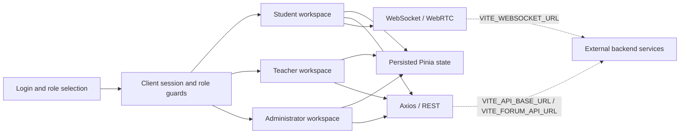

<a id="readme-top"></a>

<div align="center">
  

  <h1>🌏 International Chinese Platform</h1>

  <p><strong>A multi-role teaching workspace for international Chinese education</strong></p>
  <p>A Vue 3 frontend connecting student learning, teacher workflows, course interaction, live classes, and a digital-human classroom experience.</p>

  <p>
    <a href="#-key-features"><strong>Features</strong></a>
    ·
    <a href="#-getting-started"><strong>Getting Started</strong></a>
    ·
    <a href="./README.md"><strong>中文</strong></a>
    ·
    <a href="https://github.com/computersciencefreshmen/International_Chinese_Platform/issues"><strong>Report an Issue</strong></a>
  </p>

  <p>
    <a href="https://github.com/computersciencefreshmen/International_Chinese_Platform/actions/workflows/ci.yml">
      
    </a>
    
    
    
    
    
  </p>
</div>

---

## 📖 Overview

International Chinese Platform is a multi-role frontend organized around real international Chinese teaching workflows. It is more than a single-page showcase: one Vue 3 application contains separate student, teacher, and administrator workspaces for course discovery, teacher booking, learning requests, homework, dialogue generation, live classes, a digital-human classroom, course uploads, and platform-management views.

Role-aware routing, persisted client state, and centralized runtime configuration keep browser workflows decoupled from external REST, dialogue-generation, and WebSocket services. The repository works well as an education-product prototype, a frontend/backend integration base, and an evolving portfolio project.

> [!IMPORTANT]
> This repository contains the frontend only. Production-ready authentication, registration, verification codes, courses, teachers, homework, dialogue generation, and real-time classroom behavior still require external backend, signaling, and media infrastructure. This README distinguishes implemented frontend behavior from service-dependent and prototype functionality.

## ✨ Project Highlights

- **Purposeful multi-role structure** — Students, teachers, and administrators have separate layouts, entry points, navigation, and role guards instead of sharing one overloaded dashboard.
- **A broad teaching journey** — Course discovery, teacher booking, learning requests, homework, dialogues, live interaction, and personal settings form a recognizable online teaching flow.
- **Real-time and digital teaching exploration** — Camera, microphone, screen sharing, WebRTC foundations, class-matching animation, and a digital-human classroom prototype are included.
- **Explicit service boundaries** — REST, dialogue-generation, and WebSocket addresses are injected through environment variables with same-origin fallbacks.
- **A maintainable engineering baseline** — pnpm lockfile installs, ESLint, Prettier, production builds, and GitHub Actions create a repeatable quality gate.
- **Auditable repository consolidation** — Useful history from three early repositories is connected through merge commits in this canonical repository.

## 🎯 Key Features

### 👨‍🎓 Student Workspace

- **Course and teacher discovery** — Browse course and teacher views and enter their detail and booking flows.
- **Teacher booking** — Create an appointment, persist it in the browser, and show the latest booking on the student home page.
- **Learning requests** — Capture goals, schedule, and preferences as a request draft that can later be matched with a teacher.
- **Dialogue generation** — Submit keywords to the dedicated dialogue service and display generated practice turns.
- **Homework workspace** — Load homework, save and restore browser drafts, validate answers, and call the submission API.
- **Live and digital-human classes** — Explore live-class media controls, animated class matching, and a digital-human teaching view.
- **Personal center** — Navigate personal information, membership, password, and notification pages.

### 👩‍🏫 Teacher Workspace

- **Teaching dashboard** — Organize teacher home, teaching-coordination, and course-management entry points.
- **Online courses and details** — Browse teacher course views and course-detail flows.
- **Course-upload prototype** — Select course files, validate type and size, preview a cover, and save a browser-local course draft.
- **Teacher account view** — Provide the structure for teacher information and account pages.

### 🧭 Administrator Workspace

- **Course coordination** — Provide a unified course-coordination entry point.
- **Audit center** — Model a content-review workspace.
- **Data center** — Present an early platform analytics dashboard.
- **Account and notifications** — Include administrator password and notification views.

### ⚙️ Platform Capabilities

- **Role session and routing guards** — Protect student, teacher, and administrator routes and preserve the original destination across login redirects.
- **Persisted client state** — Use Pinia and its persistence plugin for frontend sessions, student data, and bookings.
- **Centralized networking** — Share Axios timeout, error handling, URL normalization, and environment-aware service addresses.
- **Real-time foundations** — Wrap WebSocket management plus camera, microphone, screen sharing, and WebRTC peer connections.
- **Internationalization foundation** — Integrate Vue i18n and a language selector for future full interface localization.

## 👥 Roles and Entry Points

| Role          | Default entry                  | Primary tasks                                                                                     |
| ------------- | ------------------------------ | ------------------------------------------------------------------------------------------------- |
| Student       | `/student/home`                | Courses, booking, learning requests, homework, dialogues, live classes, and digital-human classes |
| Teacher       | `/teacher/home`                | Teaching coordination, online courses, course uploads, details, and account information           |
| Administrator | `/administrator/courseDocking` | Course coordination, audits, analytics, account, and notifications                                |

Every protected role route passes through frontend session and role checks. Anonymous visitors return to `/login`; a role mismatch redirects to the current role's default home page.

## 🏗️ Architecture



`src/config/runtime.js` normalizes service addresses in one place. Without explicit configuration, REST uses the current origin, dialogue generation falls back to `/process_words`, and WebSocket selects `ws://` or `wss://` from the current page.

## 📊 Capability Maturity

| Capability                                     | Status           | Current boundary                                                                                        |
| ---------------------------------------------- | ---------------- | ------------------------------------------------------------------------------------------------------- |
| Multi-role layouts, routes, and client session | ✅ Implemented   | Production identity, authorization, and token lifecycle remain backend responsibilities                 |
| Booking, homework, and course-upload flows     | 🟡 Frontend flow | Booking persists locally; homework depends on APIs; uploads currently save a browser draft              |
| Course, teacher, and administration data       | 🟡 Mixed         | Some views request APIs, while several lists and dashboards still use static or demonstration data      |
| Live-class media controls                      | 🧪 Prototype     | Camera, microphone, and screen sharing work; room signaling, TURN, and chat protocols remain incomplete |
| Digital-human classroom                        | 🧪 Prototype     | The current interaction is simulated and is not connected to real AI, ASR, or TTS services              |
| Internationalization                           | 🧪 Foundation    | Vue i18n and language selection exist, but most product copy is still Chinese-first                     |
| Engineering quality gate                       | ✅ Implemented   | CI covers install, ESLint, Prettier, and production build; automated tests remain planned               |

## 🛠️ Technology Stack

| Layer                    | Technology                                        |
| ------------------------ | ------------------------------------------------- |
| Frontend                 | Vue 3.5, Single-File Components                   |
| Build                    | Vite 6                                            |
| Routing                  | Vue Router 4, lazy nested routes, role guards     |
| State                    | Pinia, pinia-plugin-persistedstate                |
| UI and styling           | Element Plus, Tailwind CSS 3, PostCSS, Sass       |
| Networking and real time | Axios, WebSocket, WebRTC                          |
| Internationalization     | Vue i18n                                          |
| Engineering              | pnpm 8.15.9, ESLint 9, Prettier 3, GitHub Actions |

## 🚀 Getting Started

### Prerequisites

- Node.js `>= 18`
- pnpm `8.15.9` (pinned in `package.json`)

### 1. Clone the repository

```bash
git clone https://github.com/computersciencefreshmen/International_Chinese_Platform.git
cd International_Chinese_Platform
```

### 2. Install dependencies

```bash
corepack enable
corepack prepare pnpm@8.15.9 --activate
pnpm install --frozen-lockfile
```

### 3. Configure environment variables

```bash
cp .env.example .env.local
```

Windows PowerShell:

```powershell
Copy-Item .env.example .env.local
```

Update `.env.local` for your backend and signaling services.

### 4. Start the development server

```bash
pnpm dev
```

Open the local URL printed in the terminal, normally `http://localhost:5173`.

## 🔧 Environment Variables

| Variable             | Purpose                                | Code fallback when unset                                       |
| -------------------- | -------------------------------------- | -------------------------------------------------------------- |
| `VITE_API_BASE_URL`  | REST API origin                        | `/` (current site origin)                                      |
| `VITE_FORUM_API_URL` | Full keyword-to-dialogue endpoint      | `/process_words`                                               |
| `VITE_WEBSOCKET_URL` | Chat and classroom-signaling WebSocket | Current site's `/websocket`, automatically using `ws` or `wss` |

`.env.example` contains local development examples. Every `VITE_` variable becomes visible in the browser bundle; never store passwords, private keys, or long-lived server secrets in these values.

## 📜 Commands

| Command             | Description                                       |
| ------------------- | ------------------------------------------------- |
| `pnpm dev`          | Start the Vite development server                 |
| `pnpm build`        | Create a production build in `dist/`              |
| `pnpm preview`      | Preview the production build locally              |
| `pnpm lint`         | Apply auto-fixable ESLint changes                 |
| `pnpm lint:check`   | Run ESLint without modifying files                |
| `pnpm format`       | Format `src/`                                     |
| `pnpm format:check` | Check Prettier formatting in `src/`               |
| `pnpm check`        | Run lint, formatting, and production-build checks |

Run before committing:

```bash
pnpm check
```

## 📁 Project Structure

```text
International_Chinese_Platform/
├── .github/
│   └── workflows/ci.yml      # GitHub Actions quality gate
├── public/                   # Public static assets
├── src/
│   ├── api/                  # Student, user, and shared API wrappers
│   ├── assets/               # Styles, icons, and course media
│   ├── components/           # Base, domain, and class-matching components
│   ├── config/               # REST / Forum / WebSocket runtime configuration
│   ├── i18n/                 # i18n instance and Chinese/English messages
│   ├── router/               # Multi-role nested routes and guards
│   ├── stores/               # Pinia session, student, and administrator state
│   ├── utils/                # Axios and WebSocket utilities
│   └── views/
│       ├── student/          # Student-facing pages
│       ├── teacher/          # Teacher-facing pages
│       ├── administrator/    # Administrator-facing pages
│       ├── liveClass/        # Live-class UI and WebRTC composable
│       └── login/            # Login and registration views
├── .env.example              # Local service-address examples
├── package.json              # Scripts, dependencies, and runtime requirements
├── pnpm-lock.yaml            # Reproducible dependency lockfile
└── vite.config.js            # Vite configuration
```

## ✅ Quality Assurance

| Layer                  | Gate                                                                                              |
| ---------------------- | ------------------------------------------------------------------------------------------------- |
| Static quality         | Read-only ESLint check                                                                            |
| Formatting             | Prettier check                                                                                    |
| Buildability           | Vite production build                                                                             |
| Continuous integration | Ubuntu + Node.js 20 + pnpm 8.15.9 + frozen lockfile                                               |
| Browser validation     | Manual smoke checks for login, role redirects, the student dashboard, and the digital-human route |

GitHub Actions runs the same install, check, and build sequence for pull requests and pushes to `main`. Automated unit, component, and end-to-end tests are not configured yet, so critical product changes still require browser validation.

## 🔗 Repository Consolidation

This is the project's only canonical development repository:

> [computersciencefreshmen/International_Chinese_Platform](https://github.com/computersciencefreshmen/International_Chinese_Platform)

Early code was split across:

- [computersciencefreshmen/vue3-project-initialization](https://github.com/computersciencefreshmen/vue3-project-initialization)
- [computersciencefreshmen/project](https://github.com/computersciencefreshmen/project)

Useful commits from the older repositories are now reachable from the current `main` through standard Git merge commits, including the initialization history that originally had no common ancestor. New code, issues, documentation, and releases should use this repository; the older repositories are historical references only.

## 🗺️ Roadmap

- [x] Consolidate three repository histories and establish one canonical home
- [x] Build student, teacher, and administrator route structures
- [x] Centralize REST, dialogue-service, and WebSocket runtime configuration
- [x] Add ESLint, Prettier, production-build, and GitHub Actions gates
- [ ] Align the complete backend contract and replace static course, teacher, and administration data
- [ ] Complete WebRTC rooms, signaling, TURN, and classroom chat protocols
- [ ] Connect real digital-human, AI, ASR, and TTS services
- [ ] Localize all product copy in Chinese and English
- [ ] Add unit, component, and end-to-end automated tests
- [ ] Add production deployment, monitoring, security guidance, and an open-source license

## 🚢 Deployment

```bash
pnpm build
```

The production bundle is written to `dist/`. A deployment must:

1. Inject the correct `VITE_*` variables during the build.
2. Configure SPA fallback for Vue Router history mode so unknown routes return `index.html`.
3. Use HTTPS and WSS, with correct backend CORS policies.
4. Provide authenticated signaling, TURN infrastructure, and media-security policies for production live classes.
5. Verify complete login, course, homework, dialogue, and real-time classroom flows before release.

## 🤝 Contributing

Issues and pull requests are welcome:

1. Create a clearly named branch from the latest `main`.
2. Keep the change focused and update related documentation.
3. Run `pnpm check` before committing.
4. Open a pull request and merge it into `main` with a standard merge commit after CI passes.

## 📄 License

This repository does not currently declare an open-source license. Until one is added, do not assume permission to copy, distribute, or use the code commercially.

<div align="center">
  <p>Built with ❤️ for international Chinese education.</p>
  <a href="#readme-top">⬆ Back to top</a>
</div>
