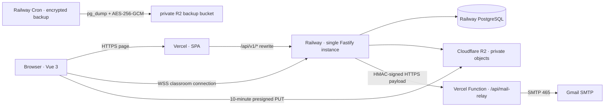

<a id="readme-top"></a>

<div align="center">
  <a href="https://github.com/computersciencefreshmen/International_Chinese_Platform">
    
  </a>

  <h1>International Chinese Platform</h1>

  <p><strong>A public-beta, full-stack collaboration platform for international Chinese education.</strong></p>
  <p>It connects teacher verification, course review, scheduled classrooms, and assignment feedback into one deployable, testable, auditable learning workflow.</p>

  <p>
    <a href="#overview"><strong>Overview</strong></a>
    ·
    <a href="#learning-journeys"><strong>Learning journeys</strong></a>
    ·
    <a href="#quick-start"><strong>Quick start</strong></a>
    ·
    <a href="#architecture"><strong>Architecture</strong></a>
    ·
    <a href="#quality"><strong>Quality evidence</strong></a>
    ·
    <a href="#documentation"><strong>Documentation</strong></a>
    ·
    <a href="./README.md"><strong>中文</strong></a>
  </p>

  <p>
    <a href="https://github.com/computersciencefreshmen/International_Chinese_Platform/actions/workflows/ci.yml">
      
    </a>
    
    
    
    
    
    
    
    
    
    
  </p>
</div>

---

<a id="overview"></a>

## Overview

International Chinese Platform is not a screen-only course prototype. It is a full-stack system that models real teaching collaboration: students, teachers, and administrators work against the same PostgreSQL domain data for authentication, teacher verification, course review, appointments, live classrooms, assignments, notifications, and Chinese dialogue practice.

The repository contains the Vue 3 client, Fastify domain API, numbered migrations, private object-storage adapter, real-time classroom protocol, tests, deployment configuration, and operating guides. The recommended public-beta topology serves the web application from Vercel, versioned APIs from Railway, private files from Cloudflare R2, and production email through a signed Vercel relay. It does not rely on an undocumented or stale external backend.

> [!IMPORTANT]
> <strong>Completeness contract</strong>: within the current public-beta boundary, a reader can install the repository, start PostgreSQL and MinIO, migrate and seed demo data, exercise all three roles, run the tests, and follow the documentation to deploy the core services. Completeness does not mean inventing commercial-LMS features: payments, formal enrollment, recording, multi-node real-time fan-out, and high availability are explicitly future scope.

### Why this repository is worth a closer look

- <strong>Business workflows instead of a menu of screens</strong>: courses, appointments, assignments, and teacher verification have server-enforced transitions, permissions, notifications, and audit records.
- <strong>One source of truth for every role</strong>: the student, teacher, and administrator workspaces operate on the same PostgreSQL domain data rather than independent mock views.
- <strong>Security boundaries live in the implementation</strong>: opaque server sessions use HttpOnly cookies; writes validate origin, role, and resource ownership; files are verified before promotion from temporary storage.
- <strong>A coherent path from local development to public beta</strong>: development uses PostgreSQL and MinIO; production uses Vercel, Railway, PostgreSQL, R2, and an HMAC-protected mail relay.
- <strong>Honest operational limits</strong>: classroom presence is currently held by one API process, so the beta deliberately runs a single backend instance instead of claiming high availability that does not exist.

<a id="learning-journeys"></a>

## Four verifiable learning journeys

Each journey should show how a real action crosses roles, state, and persistence boundaries. The four flows below are also the core journeys exercised by browser E2E.

```mermaid
flowchart TB
  subgraph Verification["Teacher verification"]
    V1["Teacher registers or changes profile"] -->|enters review queue| V2["Administrator verifies"]
    V2 -->|approves| V3["Verified: publicly discoverable and bookable"]
    V3 -->|revoked or profile changes again| V1
  end

  subgraph Course["Course review"]
    C1["Teacher drafts a course"] -->|submits| C2["Pending review"]
    C2 -->|approves| C3["Published: visible to students"]
    C2 -->|rejects with reason| C4["Rejected"]
    C4 -->|revises and resubmits| C2
  end

  subgraph Lesson["Appointment and classroom"]
    L1["Student requests a lesson"] -->|teacher accepts + conflict checks| L2["Accepted + dedicated classroom"]
    L1 -->|teacher rejects or either party cancels| L3["Closed"]
    L2 -->|short-lived one-time ticket| L4["Chat, presence, WebRTC signaling"]
    L4 -->|participant completes lesson| L5["Completed"]
  end

  subgraph Assignment["Assignment and feedback"]
    A1["Teacher writes and publishes"] -->|student saves and submits| A2["Submission"]
    A2 -->|teacher grades with feedback| A3["Student sees result"]
    A1 -->|teacher closes assignment| A4["No new writes"]
  end
```



| Journey                   | What the user experiences                                                                          | Server-side guarantee                                                                                                        |
| ------------------------- | -------------------------------------------------------------------------------------------------- | ---------------------------------------------------------------------------------------------------------------------------- |
| Teacher verification      | A profile is reviewed; a revoked teacher disappears from discovery and booking.                    | Administrator decisions, conflict protection, audit events, and notifications; profile changes return the teacher to review. |
| Course review             | A draft can be rejected, revised, resubmitted, and published; students see only published courses. | Teacher ownership, explicit review state transitions, and publication visibility.                                            |
| Appointment and classroom | A student requests a lesson; a teacher accepts; both enter a dedicated classroom.                  | Mutual conflict checks, transactional classroom creation, short-lived one-time WebSocket tickets, and room isolation.        |
| Assignment and feedback   | A teacher publishes work, a student submits, a teacher grades, and the student sees feedback.      | Deadline and closure checks, submission ownership, and persistent grading results.                                           |

### Three role workspaces

| Student                                                                                                                                              | Teacher                                                                                                                       | Administrator                                                                                                |
| ---------------------------------------------------------------------------------------------------------------------------------------------------- | ----------------------------------------------------------------------------------------------------------------------------- | ------------------------------------------------------------------------------------------------------------ |
| Discover verified teachers and published courses; request lessons; submit work; practice persistent Chinese dialogue; read notifications and grades. | Maintain a professional profile; submit courses; manage appointments; join classrooms; publish, close, and grade assignments. | Verify teachers; review courses; inspect aggregated data, audit activity, and platform-level workflow state. |

<a id="quick-start"></a>

## Quick local start

### Prerequisites

- Node.js 24 recommended; Node.js 22 and later supported
- pnpm 11.9.0, pinned by <code>packageManager</code>
- Docker Desktop or Docker Engine for local PostgreSQL and MinIO
- Optional: Python 3.12 plus Playwright Chromium for browser E2E

### 1. Clone, install, and create local configuration

```bash
git clone https://github.com/computersciencefreshmen/International_Chinese_Platform.git
cd International_Chinese_Platform
corepack enable
pnpm install --frozen-lockfile
```

Windows PowerShell:

```powershell
Copy-Item .env.example .env.local
```

macOS / Linux:

```bash
cp .env.example .env.local
```

<code>.env.local</code> keeps the development API, PostgreSQL, and MinIO connections explicit. SMTP, AI, and TURN are not prerequisites for the core teaching journeys.

### 2. Start dependencies, migrate data, seed the demo, and run the app

On a first image pull, wait until PostgreSQL is healthy and <code>minio-init</code> has completed before migrating and seeding.

```bash
docker compose up -d postgres minio minio-init
pnpm db:migrate
pnpm db:seed
pnpm dev
```

Then open:

- Web: <code>http://localhost:5173</code>
- API: <code>http://localhost:7777/api/v1</code>
- MinIO Console: <code>http://localhost:9001</code>

### 3. Verify that startup worked

macOS / Linux:

```bash
curl --fail http://localhost:7777/api/v1/ready
```

Windows PowerShell:

```powershell
Invoke-RestMethod http://localhost:7777/api/v1/ready
```

When the API is ready, open the web app and use these <strong>local-demo-only</strong> accounts:

| Role          | Email                            | Password              |
| ------------- | -------------------------------- | --------------------- |
| Student       | <code>student@example.com</code> | <code>Demo123!</code> |
| Teacher       | <code>teacher@example.com</code> | <code>Demo123!</code> |
| Administrator | <code>admin@example.com</code>   | <code>Demo123!</code> |

> Teacher verification is a manual platform-administrator review, not issuer-side credential verification. External certificate OCR and authenticity checking remain out of scope.

> [!CAUTION]
> Demo data is for explicit local or test seeding only. Production rejects <code>SEED_ON_START=true</code>; do not run <code>pnpm db:seed</code> or <code>pnpm db:reset</code> against a production database.

### Useful commands

```bash
pnpm dev                 # run Vite and Fastify together
pnpm build               # build the production web client
pnpm db:migrate          # apply pending numbered PostgreSQL migrations
pnpm db:seed             # import idempotent demo data outside production
pnpm db:reset            # rebuild local development data; drops the local public schema
pnpm admin:bootstrap     # create the first production administrator once
pnpm test:api            # Node API, database, and security tests
pnpm check               # ESLint + Prettier + API tests + production build
pnpm backup:create       # after production backup setup, create an encrypted PostgreSQL backup
pnpm backup:restore      # after production restore setup, restore only with explicit CONFIRM_RESTORE
```

<a id="architecture"></a>

## Architecture: clear responsibilities, explicit trust boundaries



For local development, Vite, Fastify, PostgreSQL, and MinIO replace Vercel, Railway, and R2. The application keeps the same S3 interface and database-migration discipline so that development behavior does not silently diverge from production. Before a browser receives a presigned PUT, it asks the API for a restricted upload intent; after upload, the API checks size, magic bytes, and SHA-256, then promotes the object only when its ETag still matches.

| Component             | Responsibility                                                                                        | Why it is separated this way                                                                                                                    |
| --------------------- | ----------------------------------------------------------------------------------------------------- | ----------------------------------------------------------------------------------------------------------------------------------------------- |
| Vue 3 + Vercel        | UI, routing, and static assets                                                                        | Static content stays close to users; only versioned business APIs are rewritten, so the browser still reaches the API with first-party cookies. |
| Fastify + Railway     | Domain API, authorization, state transitions, and WebSocket                                           | Teaching rules remain on the server; the beta keeps one instance instead of pretending cross-instance room coordination is solved.              |
| PostgreSQL            | Source of truth for users, courses, appointments, assignments, reviews, notifications, and audit data | Numbered migrations, transactions, and concurrency protection keep cross-role workflows independent of front-end ordering.                      |
| Cloudflare R2 / MinIO | Private files and temporary upload objects                                                            | Direct browser upload avoids proxying large bodies through the API; MinIO reproduces the S3 contract locally.                                   |
| Vercel mail relay     | Holds Gmail SMTP credentials and delivers verification mail                                           | Railway sends a minimal signed payload; SMTP credentials never live in the browser, API environment, or Git.                                    |
| Railway backup Cron   | Exports and encrypts PostgreSQL backups                                                               | Backup work is separate from the API process, and restore still requires explicit confirmation.                                                 |

<a id="quality"></a>

## Engineering credibility and quality evidence

| Area                       | Implementation                                                                                                                                    | Evidence                                                                                              |
| -------------------------- | ------------------------------------------------------------------------------------------------------------------------------------------------- | ----------------------------------------------------------------------------------------------------- |
| Identity and authorization | scrypt password hashes, server-side session digests, HttpOnly cookies, origin checks, role and resource-ownership checks                          | [authentication tests](./server/test/auth.test.js), [security policy](./SECURITY.md)                  |
| Teaching state             | PostgreSQL transactions, conditional updates, numbered migrations, audit records, and notifications                                               | [domain routes](./server/routes), [migrations](./server/db/migrations)                                |
| Private files              | upload intents, temporary keys, content type and length binding, magic-byte/SHA-256 validation, ETag-conditional promotion, short-lived downloads | [object-storage ADR](./docs/adr/0004-r2-object-storage.md), [file tests](./server/test/files.test.js) |
| Live classroom             | short-lived single-use classroom tickets; history, membership, and WebRTC signaling isolated by classroom                                         | [classroom tests](./server/test/realtime-classroom.test.js)                                           |
| Mail boundary              | HMAC request from Railway to a Vercel Function with freshness and strict-payload checks                                                           | [mail-relay ADR](./docs/adr/0006-vercel-hmac-mail-relay.md)                                           |
| Delivery and recovery      | health/readiness probes, expand-only migrations, encrypted backups, restore confirmation, and rollback guidance                                   | [operations manual](./docs/operations.md)                                                             |

### What CI actually proves

<code>pnpm check</code> runs ESLint, Prettier, the complete Node API/database/security suite, and a Vite production build. The repository currently contains <strong>71 Node tests</strong>. GitHub Actions also starts isolated PostgreSQL and MinIO services, builds the production app, and exercises four cross-role browser journeys:

1. Course submission → rejection → revision → approval → student catalog visibility.
2. Student request → teacher acceptance → dedicated classroom → classroom completion.
3. Teacher publishes → student submits → teacher grades → student sees feedback.
4. Administrator revokes verification → student cannot discover or book → administrator reapproves → teacher becomes public again.

To reproduce browser E2E locally, install <code>e2e/requirements.txt</code> and Playwright Chromium, start the service with the same PostgreSQL, MinIO, and production environment used by the [CI workflow](./.github/workflows/ci.yml), then run <code>python e2e/test_workflows.py</code>. See the [Node tests](./server/test) and [browser E2E](./e2e/test_workflows.py).

## Deployment, operations, and beta scope

The recommended public-beta topology is Vercel for the Vue SPA and mail-relay function; Railway for one Fastify API instance, PostgreSQL, and an independent backup Cron; and Cloudflare R2 for private files and encrypted backups. Secrets, R2 CORS, migrations, administrator bootstrap, monitoring, restore drills, and rollback are documented in the [operations manual](./docs/operations.md).

| A good fit today                                                                                                | Not in the current scope                                                                                                                                           |
| --------------------------------------------------------------------------------------------------------------- | ------------------------------------------------------------------------------------------------------------------------------------------------------------------ |
| Course projects, portfolio demonstrations, small self-hosted teaching collaboration, and public-beta validation | Payments, formal enrollment and seat deduction, recording, external certificate OCR/verification, paid AI, multi-instance real-time fan-out, and high availability |
| Classrooms that can connect directly or have a configured TURN service                                          | Reliable audio/video behind strict NAT, because TURN is not bundled yet                                                                                            |

Course price and capacity are informational only; they are not a payment or seat-allocation system. Until a formal enrollment model exists, assignments for published courses are visible to and submittable by every signed-in student; there is no roster or enrollment authorization layer yet. Before the system can scale horizontally, classroom presence needs cross-instance broadcast and coordination.

<a id="documentation"></a>

## Documentation map

- [Public-beta operations manual](./docs/operations.md): production variables, R2, mail relay, backup, restore, and rollback.
- [ADR 0003: PostgreSQL](./docs/adr/0003-postgresql-production-database.md), [ADR 0004: R2](./docs/adr/0004-r2-object-storage.md), [ADR 0005: Vercel / Railway](./docs/adr/0005-vercel-railway-split-deployment.md), and [ADR 0006: HMAC mail relay](./docs/adr/0006-vercel-hmac-mail-relay.md): the current production architecture decisions.
- [Historical plans](./docs/plans): the migration story from the earlier SQLite prototype to the PostgreSQL/R2 cloud architecture. These are not the source of truth for the current runtime.
- [Security policy](./SECURITY.md): private disclosure, supported scope, and deployment security expectations.

## Main directories

```text
src/                    Vue 3 client and role workspaces
server/routes/          Fastify domain API
server/db/migrations/   numbered PostgreSQL migrations
server/services/        mail, dialogue, and object-storage adapters
server/ops/             backup and restore
server/test/            API, database, and security integration tests
e2e/                    four cross-role Playwright workflows
docs/adr/               architecture decision records
docs/operations.md      deployment and operations manual
```

## Contributions, security, and license

Issues and pull requests are welcome. For larger behavior changes, describe the user journey, server-side state change, test strategy, and documentation impact first; each pull request should keep implementation, tests, and documentation aligned.

Report security issues privately through [SECURITY.md](./SECURITY.md). Do not publish credentials, personal data, or vulnerability details in public issues, screenshots, or demo environments.

This repository currently has no open-source license. Except where applicable law clearly permits otherwise, obtain the maintainer’s permission before reuse, redistribution, or production use.

<p align="right"><a href="#readme-top">Back to top ↑</a></p>
