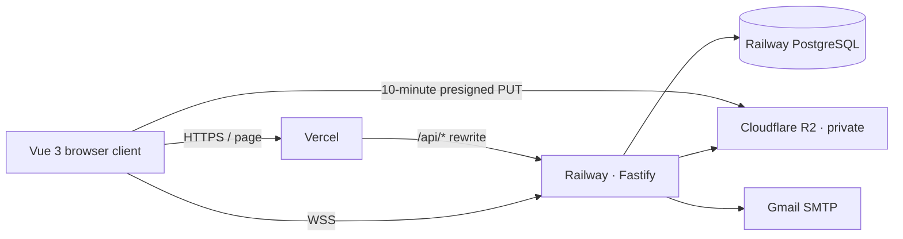

# International Chinese Platform

A public-beta full-stack platform for international Chinese education. Students, teachers, and administrators share persistent workflows for registration, teacher verification, courses, appointments, live classrooms, assignments, notifications, and dialogue practice.

## Implemented capabilities

- Email-code registration, login/logout, database sessions, and HttpOnly cookies
- Student, teacher, and administrator authorization with ownership checks
- Teacher applications, administrator review, and public teacher discovery
- Course draft, review, revision, publishing, and ratings
- Appointment acceptance/rejection, classroom creation, and completion
- Assignment questions, submissions, grading, and results
- Notifications, persistent dialogue sessions, and audit logs
- One-time WebSocket tickets, classroom chat, presence, and WebRTC signalling
- PostgreSQL numbered migrations, transactions, and concurrency guards
- Private R2/MinIO storage with upload intents, quota reservations, content validation, conditional promotion, and signed downloads
- One-time production administrator bootstrap with mandatory first-login password reset

## Architecture



The Beta keeps one backend instance because live-room membership is held in process memory. Vercel proxies `/api/*` so browser sessions remain first-party cookies; classroom WebSockets connect directly to Railway.

## Local development

Requires Node.js 24, pnpm 11, and Docker Desktop / Docker Engine.

```bash
pnpm install --frozen-lockfile
docker compose up -d postgres minio minio-init
pnpm db:migrate
pnpm db:seed
pnpm dev
```

- Frontend: `http://localhost:5173`
- API: `http://localhost:7777/api/v1`
- MinIO console: `http://localhost:9001`

See [`.env.example`](./.env.example). Local development and CI use PostgreSQL as well, eliminating SQLite/production drift.

## Commands

```bash
pnpm dev
pnpm build
pnpm db:migrate
pnpm db:seed
pnpm admin:bootstrap
pnpm test:api
pnpm check
pnpm backup:create
pnpm backup:restore
```

Production configuration rejects `SEED_ON_START=true`; demo users and courses are never imported automatically.

## File security model

The browser may write only short-lived keys under `tmp/uploads/`; signatures bind Content-Type and Content-Length. Completion streams the object, validates size, magic bytes, and SHA-256, then conditionally copies the source ETag into a new `files/` key. A final key never receives a PUT URL, so reusing the original URL cannot overwrite a verified file.

Deletion is backed by a retryable database outbox. Production R2 should also expire `tmp/` after one day. Private video and material downloads first pass API authorization and then redirect to a five-minute signed URL.

## Deployment

- Frontend: Vercel project `international-chinese-platform`
- Backend: one Railway Docker service
- Database: Railway PostgreSQL
- Files: private Cloudflare R2 bucket
- Mail: Gmail SMTP application password

See the [operations manual](./docs/operations.md) for exact secrets, R2 CORS/lifecycle, administrator bootstrap, backups, restore drills, and rollback. Architecture decisions are in [`docs/adr`](./docs/adr).

## Verification

CI uses PostgreSQL and isolated MinIO, then runs source checks, API integration tests, the production build, and cross-role Playwright workflows. File tests cover forged extensions, quota races, concurrent completion, presigned URL reuse, ETag-conditional promotion, and unauthorized downloads.

## Public Beta limits

- No TURN server; audio/video may fail behind strict NAT.
- No multi-instance room broadcasting, HA, payments, formal enrollment, class recording, or paid external AI.
- Price and capacity are informational course fields, not payment or seat allocation.

Security issues should be reported privately through [`SECURITY.md`](./SECURITY.md), never through a public issue containing credentials or vulnerability details.
