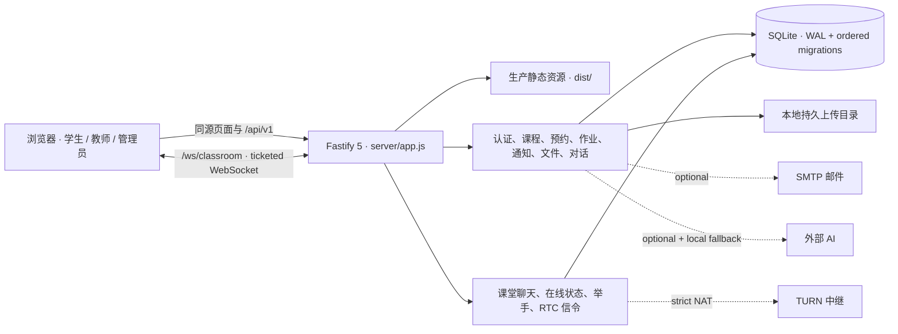

<a id="readme-top"></a>

<div align="center">
  

  <h1>International Chinese Platform</h1>

  <p><strong>面向国际中文教育的自包含全栈教学协作平台</strong></p>
  <p>把学生学习、教师授课与平台审核放进同一套可运行、可测试、可部署的教学闭环。</p>

  <p>
    <a href="#overview"><strong>项目概览</strong></a>
    ·
    <a href="#completeness"><strong>完整性定义</strong></a>
    ·
    <a href="#quick-start"><strong>快速开始</strong></a>
    ·
    <a href="#documentation"><strong>文档</strong></a>
    ·
    <a href="./README.en.md"><strong>English</strong></a>
  </p>

  <p>
    <a href="https://github.com/computersciencefreshmen/International_Chinese_Platform/actions/workflows/ci.yml">
      
    </a>
    
    
    
    
    
    
    
  </p>
</div>

---

<a id="overview"></a>

## 项目概览

International Chinese Platform 是一个围绕真实教学协作流程构建的模块化单体。Vue 3 前端、Fastify API、SQLite 持久层、文件服务和实时课堂协议均位于本仓库；后端入口在 [`server/`](./server/)，所有领域路由由 [`server/app.js`](./server/app.js) 统一注册。项目不依赖早期仓库中可能已经失效或版本不明的外部后端。

它覆盖学生、教师和管理员三个工作区，并让课程审核、教师预约与作业评分真正跨角色流转。关键状态保存在数据库中，通知和审计记录随业务事务写入，而不是只在页面中模拟成功。

> [!NOTE]
> 本仓库将“完整”定义为：在单实例部署边界内，可以独立安装、迁移、启动、演示、测试和备份核心教学流程。它不是一套宣称具备支付、正式选课、课堂录制和无限水平扩展能力的商业 LMS，也没有虚构在线 Demo 或截图。

### Portfolio Highlights

- **不是前端壳工程** — 认证、授权、领域 API、迁移、种子数据、上传、邮件适配、WebSocket、测试与生产容器都在同一仓库。
- **围绕状态闭环建模** — 课程可驳回后修改再审；预约在冲突检查后生成课堂；作业从草稿、提交到评分均受服务端状态机约束。
- **跨角色数据一致性** — 教师、学生与管理员看到同一份 SQLite 业务数据；通知、审核记录和关键操作日志与状态变更一起持久化。
- **安全默认值可解释** — 使用服务端不透明会话、HttpOnly Cookie、scrypt 密码哈希、来源检查、角色与所有权校验、速率限制和文件魔数验证。
- **外部依赖有降级边界** — SMTP、AI 和 TURN 都通过适配器接入；未配置外部 AI 时使用本地确定性对话，核心教学流程仍然可运行。
- **能进入部署与运维阶段** — 提供有序迁移、一次性管理员引导、多阶段 Docker 镜像、健康探针、持久卷、备份和恢复说明。

<a id="completeness"></a>

## 完整性定义

| 分类          | 状态               | 本仓库的承诺                                                                                                 |
| ------------- | ------------------ | ------------------------------------------------------------------------------------------------------------ |
| 核心教学域    | ✅ Complete        | 三角色认证与权限、教师认证、课程审核、预约与课堂、作业提交评分、通知、档案、文件和对话均有前后端实现与持久化 |
| 工程与运维    | ✅ Complete        | 可复现安装、自动迁移、演示数据、API 测试、生产构建、CI、Docker Compose、健康检查、管理员引导、备份与恢复文档 |
| SMTP 邮件     | ◇ Conditional      | 本地开发可直接取得开发验证码；开放生产注册时必须配置 `SMTP_URL`、`MAIL_FROM` 和稳定的验证码密钥              |
| AI 对话       | ◇ Optional adapter | 可调用符合当前 JSON 契约的外部 AI；超时、失败或未配置时回退到本地确定性教学对话                              |
| TURN 中继     | ◇ Conditional      | 同网段或可直连环境可使用 WebRTC；严格 NAT、企业网络和可靠生产课堂必须配置 TURN                               |
| 商业 LMS 能力 | — Out of scope     | 支付结算、正式选课与容量扣减、证书颁发方联网核验/OCR、课堂录制、版权工作流、多节点 WebSocket 不在当前范围    |

价格和容量目前作为课程信息展示，不代表已经实现收费或正式席位占用。在正式选课模型加入前，已发布课程的作业对所有登录学生可见并可提交。SQLite 方案面向单进程、单副本；若要水平扩展，需先迁移持久层与实时房间协调机制。

## 三角色工作区

### 学生

- 注册、登录、恢复会话、维护资料和修改密码。
- 浏览已发布课程与平台已认证教师的专业档案，创建或取消预约并接收状态通知。
- 在可加入时间窗内进入课堂，使用聊天、举手和 WebRTC 音视频信令，并可确认完成课堂。
- 查看已发布作业、保存服务端草稿、提交答案并查看教师评分与反馈。
- 创建可持久化的中文对话练习；外部 AI 不可用时仍可使用本地教学反馈。
- 通过通知深链回到对应预约、课堂或作业上下文。

### 教师

- 维护学校、职称、教龄、专长、语言、教学风格等专业资料。
- 注册后进入管理员认证队列；已认证教师修改个人或专业资料后会自动回到待审核状态。
- 创建和编辑课程，提交审核，并根据驳回意见修改后再次提交。
- 接受或拒绝学生预约；服务端同时检查教师与学生双方的时间冲突。
- 进入、完成课堂，查看历史消息并参与实时互动。
- 创建、编辑、发布和关闭作业，查看提交列表并完成评分反馈。

### 管理员

- 查看待审核课程，批准发布或填写理由驳回。
- 核验教师提交的机构、职称和证书资料，批准或撤销平台内教师认证并填写审核依据。
- 查看用户、课程、预约、作业、提交和审核等聚合指标。
- 查看关键领域操作形成的近期审计活动。
- 维护自己的会话、密码和通知；首个生产管理员通过一次性命令安全创建。

## 四条核心状态闭环

```mermaid
flowchart TB
  subgraph Verification["教师认证闭环"]
    T1["pending · 教师注册或资料变更"] -->|管理员人工核验通过| T2["verified · 可公开展示与预约"]
    T2 -->|管理员撤销或教师再次修改资料| T1
  end

  subgraph Course["课程审核闭环"]
    C1["draft · 教师创建"] -->|提交审核| C2["pending"]
    C2 -->|管理员通过| C3["published · 学生可见"]
    C2 -->|管理员驳回并给出理由| C4["rejected"]
    C4 -->|教师修改并重提| C2
  end

  subgraph Appointment["预约与课堂闭环"]
    A1["pending · 学生发起"] -->|教师接受 + 双方冲突检查| A2["accepted + scheduled classroom"]
    A1 -->|教师拒绝| A3["rejected"]
    A1 -->|参与者取消| A4["cancelled"]
    A2 -->|进入时间窗 + 一次性票据| A5["WebSocket / WebRTC classroom"]
    A2 -->|参与者取消| A4
    A5 -->|参与者完成课堂| A6["completed + closed classroom"]
  end

  subgraph Homework["作业提交评分闭环"]
    H1["draft · 教师编写"] -->|截止时间校验后发布| H2["published"]
    H2 -->|学生保存| H3["draft submission"]
    H3 -->|截止前提交| H4["submitted"]
    H4 -->|教师评分| H5["graded · 分数与反馈"]
    H2 -->|教师关闭| H6["closed · 禁止新写入"]
  end
```



这些转换在服务端校验，并结合事务、唯一约束、通知去重和审计记录防止页面绕过或部分写入。

## 应用架构



开发环境由 Vite 在 `http://localhost:5173` 提供页面，并把 `/api` 和 `/ws` 代理到 `http://127.0.0.1:7777`。生产环境由同一个 Fastify 进程在 `7777` 端口同源托管 `dist/`、`/api/v1`（包括受权限控制的文件内容）和 WebSocket；公网 TLS 应由反向代理终止。

## 技术栈

| 层级       | 技术                                                                   |
| ---------- | ---------------------------------------------------------------------- |
| Web 客户端 | Vue 3.5、Vite 6、Vue Router 4、Pinia 2                                 |
| UI 与样式  | Element Plus 2、Tailwind CSS 3、Sass                                   |
| API        | Fastify 5、Zod 4、Node.js ESM                                          |
| 数据       | SQLite、better-sqlite3、WAL、有序迁移台账                              |
| 认证与安全 | scrypt、不透明服务端会话、HttpOnly Cookie、Helmet、Rate Limit          |
| 实时课堂   | WebSocket、WebRTC 信令、一次性短期课堂票据                             |
| 外部适配器 | Nodemailer / SMTP、HTTP AI provider、TURN                              |
| 质量与交付 | Node test runner、ESLint 9、Prettier 3、GitHub Actions、Docker Compose |

<a id="quick-start"></a>

## 快速开始

### 前置要求

- 推荐 Node.js 24；`package.json` 的最低版本为 Node.js 22。
- pnpm `11.9.0`。
- 如需浏览器 E2E，另需 Python 3.12 与 Playwright Chromium。

### 1. 克隆与安装

```bash
git clone https://github.com/computersciencefreshmen/International_Chinese_Platform.git
cd International_Chinese_Platform
corepack enable
corepack prepare pnpm@11.9.0 --activate
pnpm install --frozen-lockfile
```

### 2. 创建本地配置

macOS / Linux：

```bash
cp .env.example .env.local
```

Windows PowerShell：

```powershell
Copy-Item .env.example .env.local
```

默认配置即可运行本地完整流程；外部 SMTP、AI 和 TURN 均不是本地演示的前置条件。

### 3. 初始化演示数据库

```bash
pnpm db:reset
```

> [!CAUTION]
> `db:reset` 会删除 `DATABASE_PATH` 指向的 SQLite 文件及 WAL/SHM 文件，再重建演示数据。只应对本地开发数据库使用；生产发布请运行迁移并先完成备份。

### 4. 启动 Web 与 API

```bash
pnpm dev
```

- Web：<http://localhost:5173>
- API：<http://127.0.0.1:7777/api/v1>
- 健康检查：<http://127.0.0.1:7777/api/v1/health>

### 演示账号

| 角色   | 邮箱                  | 密码       | 默认入口                       |
| ------ | --------------------- | ---------- | ------------------------------ |
| 学生   | `student@example.com` | `Demo123!` | `/student/home`                |
| 教师   | `teacher@example.com` | `Demo123!` | `/teacher/home`                |
| 管理员 | `admin@example.com`   | `Demo123!` | `/administrator/courseDocking` |

这些账号由本地 seed 创建，不能用于生产。生产镜像固定 `SEED_ON_START=false`。

## 环境变量

完整的本地模板见 [`.env.example`](./.env.example)，生产配置与密钥要求见 [`docs/operations.md`](./docs/operations.md)。

| 变量                                                    | 用途                             | 默认或边界                                                           |
| ------------------------------------------------------- | -------------------------------- | -------------------------------------------------------------------- |
| `VITE_API_BASE_URL`                                     | 浏览器 API 前缀                  | `/api/v1`；推荐保持同源                                              |
| `HOST` / `PORT`                                         | API 监听地址与端口               | `127.0.0.1` / `7777`                                                 |
| `DATABASE_PATH`                                         | SQLite 文件                      | `.data/platform.db`                                                  |
| `UPLOAD_DIR`                                            | 上传文件目录                     | `.data/uploads`                                                      |
| `UPLOAD_OWNER_QUOTA_BYTES` / `UPLOAD_TOTAL_QUOTA_BYTES` | 用户与平台上传总配额             | 默认 250 MiB / 5 GiB；单实例内原子预留                               |
| `UPLOAD_MAX_CONCURRENT`                                 | 全局并发上传槽位                 | 默认 `4`，最大 `32`                                                  |
| `APP_ORIGIN`                                            | 允许携带 Cookie 写请求的精确来源 | 开发为 `http://localhost:5173`；生产必须是公网 HTTPS origin          |
| `SESSION_TTL_HOURS`                                     | 会话有效期                       | `12`                                                                 |
| `VERIFICATION_CODE_SECRET`                              | 注册验证码 HMAC 密钥             | 生产必须设置高熵、稳定值                                             |
| `SMTP_URL` / `MAIL_FROM`                                | 注册验证码邮件                   | 生产开放注册时必需                                                   |
| `AI_API_URL` / `AI_API_KEY`                             | 可选外部对话生成器               | 未配置或失败时使用本地确定性实现                                     |
| `TURN_URL` / `TURN_USERNAME` / `TURN_CREDENTIAL`        | 可选 WebRTC 中继                 | 严格 NAT 和可靠生产课堂需要                                          |
| `SEED_ON_START`                                         | 启动时写入演示数据               | 开发默认开启；生产 Compose 固定关闭                                  |
| `SECURE_COOKIES` / `ALLOW_BEARER_AUTH` / `TRUST_PROXY`  | Cookie、Bearer 兼容与代理边界    | 生产 Compose 启用 Secure Cookie、关闭 Bearer；代理信任必须按拓扑设置 |
| `ADMIN_EMAIL` / `ADMIN_PASSWORD` / `ADMIN_DISPLAY_NAME` | 一次性首个管理员引导             | 只在运行引导命令时临时注入，不应保存在生产环境文件                   |

所有 `VITE_` 变量会进入浏览器构建产物，禁止在其中存放密钥。生产注册必须同时具备 SMTP 和验证码密钥；开发模式在未配置 SMTP 时会返回仅供本机测试的验证码。

## 数据库迁移与管理员引导

数据库打开时会读取 `schema_migrations` 台账，并在事务中依次应用 [`server/db/database.js`](./server/db/database.js) 中的迁移。也可以显式执行：

```bash
pnpm db:migrate
```

生产环境不创建演示管理员。首次部署后，临时注入 `ADMIN_EMAIL`、`ADMIN_PASSWORD` 和 `ADMIN_DISPLAY_NAME`，再执行：

```bash
pnpm admin:bootstrap
```

管理员密码必须至少 12 位，并包含大写字母、小写字母、数字和特殊字符。命令只允许创建首个管理员；检测到已有管理员时会拒绝覆盖。Docker 中的安全注入方式、备份、迁移与恢复流程见[运维手册](./docs/operations.md)。

## 测试与质量门禁

```bash
pnpm test:api
pnpm check
```

| 层级         | 当前覆盖                                                                                                                 |
| ------------ | ------------------------------------------------------------------------------------------------------------------------ |
| API 集成测试 | **53 / 53 通过**；覆盖认证、教师审核、课程、预约与课堂、作业、迁移、邮件、流式上传与配额、通知、资料、对话和实时房间隔离 |
| 浏览器 E2E   | **4 条跨角色流程通过**；真实 UI 登录三个角色，验证教师认证撤销/恢复、课程审核、预约/课堂完成、作业提交/评分              |
| 静态质量     | `pnpm check` 依次运行 ESLint、Prettier、API 测试和生产构建                                                               |
| 持续集成     | 独立 Validate 与 Cross-role browser E2E 任务；Node 24、pnpm 11.9.0、Python 3.12、冻结锁文件和隔离数据库                  |

浏览器测试使用锁定版本的 Python Playwright。先安装测试依赖并构建生产前端：

```bash
python -m pip install --requirement e2e/requirements.txt
python -m playwright install chromium
pnpm build
```

在第一个终端启动隔离的生产模式服务。macOS / Linux：

```bash
mkdir -p .data
rm -f .data/e2e.db .data/e2e.db-shm .data/e2e.db-wal
NODE_ENV=production \
SEED_ON_START=true \
SECURE_COOKIES=false \
APP_ORIGIN=http://localhost:7777 \
VERIFICATION_CODE_SECRET=e2e-only-verification-secret-32-characters \
DATABASE_PATH=.data/e2e.db \
pnpm start
```

Windows PowerShell：

```powershell
New-Item -ItemType Directory -Force .data | Out-Null
Remove-Item -Force -ErrorAction SilentlyContinue .data/e2e.db, .data/e2e.db-shm, .data/e2e.db-wal
$env:NODE_ENV = 'production'
$env:SEED_ON_START = 'true'
$env:SECURE_COOKIES = 'false'
$env:APP_ORIGIN = 'http://localhost:7777'
$env:VERIFICATION_CODE_SECRET = 'e2e-only-verification-secret-32-characters'
$env:DATABASE_PATH = '.data/e2e.db'
pnpm start
```

在第二个终端执行：

```bash
python e2e/test_workflows.py
```

脚本默认访问 `http://localhost:7777`；可通过 `E2E_BASE_URL` 改写地址，通过 `E2E_BROWSER_EXECUTABLE` 使用本机 Chrome。失败时截图、trace 和浏览器日志写入 `test-results/e2e/`。CI 会自行构建、安装 Chromium、启动独立 seed 数据库并上传失败产物。

API 测试使用临时数据库，不依赖演示数据库。仓库当前不宣称存在公开托管的 Demo；可复现验证入口是本地启动、自动测试和 Docker 部署。

## Docker 同源部署

生产镜像由 Node 24 多阶段构建生成，并以非 root 用户运行。准备好受限制的 `.env.production` 后：

```bash
docker compose --env-file .env.production build --pull
docker compose --env-file .env.production up -d
docker compose --env-file .env.production ps
```

Compose 默认只把应用发布到宿主机 `127.0.0.1:7777`，并将数据库和上传分别放入持久卷。反向代理必须让页面、`/api/v1`、上传文件和 `/ws` 共享同一公网 origin；不要把 API 单独暴露到另一个域名。

上线前请完整阅读[生产部署与运维手册](./docs/operations.md)。其中包含 TLS 代理示例、管理员引导、迁移、冷备份、恢复演练、监控和事故处理，而不把“构建成功”等同于“生产就绪”。

## 项目结构

```text
International_Chinese_Platform/
├── src/                         # Vue 3 客户端与三个角色工作区
│   ├── api/                     # 同源 API 调用
│   ├── components/              # 账户、服务与基础组件
│   ├── router/                  # 会话恢复与角色路由守卫
│   ├── stores/                  # Pinia 状态
│   └── views/                   # 学生、教师、管理员与课堂页面
├── server/                      # Fastify 后端（不是外部依赖）
│   ├── app.js                   # 应用组合根与全部路由注册
│   ├── routes/                  # 认证及领域 API / WebSocket
│   ├── db/                      # Schema、迁移、seed、reset、管理员引导
│   ├── services/                # SMTP 与 AI 适配器
│   └── test/                    # 53 项 API 集成测试
├── e2e/                         # Python Playwright 跨角色浏览器测试
├── docs/
│   ├── adr/                     # 架构决策记录
│   ├── plans/                   # 完整化设计与实施计划
│   └── operations.md            # 生产部署、备份与恢复
├── .github/workflows/ci.yml     # 质量门禁与浏览器 E2E
├── Dockerfile                   # Node 24 多阶段生产镜像
├── docker-compose.yml           # 单实例、双持久卷部署
├── SECURITY.md                  # 漏洞报告与安全期望
└── .env.example                 # 本地配置模板
```

## API 分组

所有 REST 接口使用 `/api/v1` 前缀，并返回统一的 `{ code, msg, data }` 结构。实现以 [`server/app.js`](./server/app.js) 的注册列表为准。

| 分组                      | 主要路径                                                                                    | 能力                                            |
| ------------------------- | ------------------------------------------------------------------------------------------- | ----------------------------------------------- |
| System                    | `/health`, `/ready`                                                                         | 存活与数据库就绪检查                            |
| Auth                      | `/auth/verification-code`, `/auth/register`, `/auth/login`, `/auth/logout`, `/auth/session` | 验证码、账号与会话生命周期                      |
| Profile & Teachers        | `/me`, `/me/password`, `/teachers`                                                          | 个人资料、教师专业档案与发现                    |
| Courses & Admin           | `/courses`, `/admin/course-reviews`, `/admin/teacher-verifications`, `/admin/metrics`       | 课程 CRUD、课程与教师审核、运营指标             |
| Appointments & Classrooms | `/appointments`, `/classrooms/:id/*`                                                        | 预约响应、冲突校验、加入信息、完成课堂          |
| Assignments               | `/courses/:id/assignments`, `/assignments`, `/submissions`, `/me/submissions`               | 作业生命周期、学生提交与教师评分                |
| Files                     | `/files`, `/files/:id/content`                                                              | 分类上传、内容校验、元数据与删除                |
| Dialogues                 | `/dialogues`, `/dialogues/:id/messages`                                                     | 持久化对话生成与继续练习                        |
| Notifications             | `/notifications`                                                                            | 分页、未读状态与全部已读                        |
| Realtime                  | `/classrooms/:id/ticket`, `/classrooms/:id/messages`, `/ws/classroom`                       | 一次性票据、历史消息、在线状态、聊天与 RTC 信令 |

## 安全设计

- 密码使用参数化 scrypt 哈希；登录路径执行无用户差异的密码校验以降低枚举信号。
- 浏览器只持有 HttpOnly、SameSite 会话 Cookie；数据库保存不透明令牌的摘要，登出、改密和过期均会撤销会话。
- Cookie 写请求校验 `Origin`，生产 Compose 默认启用 Secure Cookie 并关闭 Bearer 认证。
- 领域写操作按角色和资源关系授权，业务状态转换在服务端再次检查；非公开文件的内容、元数据和删除均限 owner/admin。
- 未认证教师不会进入公开发现且不能被预约；管理员的批准/撤销会通知教师并写审计，教师修改资料会自动回到待审核状态。
- Zod 校验输入；Helmet 设置安全响应头；Fastify 对请求和敏感接口执行速率限制。
- 上传采用私有临时文件流式落盘、增量哈希、签名字节校验和同卷原子改名，并执行角色、大小、用户/平台配额与全局并发限制；这不是恶意内容扫描。
- 验证码以摘要保存、限制尝试次数并一次性消费；邮件发送失败不会创建可用注册流程。
- 关键审核、预约、作业和管理员引导操作写入审计日志。

课堂票据签发、握手、历史读取、每个实时事件以及周期性连接清理都会重新校验会话、账号、课堂状态和参与者关系；权限失效的连接会被关闭。非公开课程视频和材料当前只允许 owner/admin 读取；由于正式选课不在本项目范围内，尚未建立学生的课程资料授权关系。需要分发私有课程资料的部署，应先补充选课或资源授权模型。

这些措施不等于第三方安全认证。部署者仍需管理 TLS、密钥、依赖更新、日志、数据保留和备份访问。漏洞请按 [`SECURITY.md`](./SECURITY.md) 私密报告，不要在公开 Issue 中披露细节。

## 生产边界

| 边界     | 当前设计                                                         | 扩展方向                                                    |
| -------- | ---------------------------------------------------------------- | ----------------------------------------------------------- |
| 数据库   | SQLite WAL，单应用副本                                           | 多实例前迁移到服务型数据库并重新评估事务与迁移策略          |
| 实时课堂 | 单进程 WebSocket 房间，WebRTC 点对点媒体                         | 多节点需要共享 presence/pub-sub、粘性路由和独立媒体基础设施 |
| 网络穿透 | TURN 为可选配置                                                  | 严格 NAT 或企业网络的生产课堂必须提供受监控的 TURN          |
| 文件     | 本地持久卷；默认用户 250 MiB、平台 5 GiB、4 个并发上传槽位       | 大规模部署可迁移对象存储并补充扫描、生命周期与 CDN          |
| 邮件     | SMTP 适配器                                                      | 生产注册必须配置可交付的邮件服务并监控失败率                |
| AI       | 单一 HTTP 适配器 + 本地确定性降级                                | 可增加供应商策略、成本控制、内容安全和可观测性              |
| 教学商务 | 平台内管理员教师认证；价格与容量仍是资料字段                     | 支付、正式选课及证书颁发方联网核验/OCR 需独立领域设计       |
| 课堂媒体 | 实时音视频与信令                                                 | 录制、转码、回放和内容审核不在当前实现中                    |
| 持续授权 | 票据、握手、每个事件及周期清理均复验权限；私有材料限 owner/admin | 多实例时增加共享撤权信号，并补充基于选课关系的学生资料权限  |

<a id="documentation"></a>

## 文档索引

- [`README.md`](./README.md) — 中文主文档。
- [`README.en.md`](./README.en.md) — 等价英文文档。
- [`docs/operations.md`](./docs/operations.md) — Docker 生产部署、反向代理、迁移、备份、恢复与监控。
- [`SECURITY.md`](./SECURITY.md) — 漏洞报告流程与部署安全期望。
- [`docs/adr/0001-self-contained-modular-monolith.md`](./docs/adr/0001-self-contained-modular-monolith.md) — 自包含模块化单体决策。
- [`docs/adr/0002-server-side-opaque-sessions.md`](./docs/adr/0002-server-side-opaque-sessions.md) — 服务端不透明会话决策。
- [`docs/plans/2026-07-19-full-stack-completion-design.md`](./docs/plans/2026-07-19-full-stack-completion-design.md) — 完整化设计说明。
- [`docs/plans/2026-07-19-full-stack-completion.md`](./docs/plans/2026-07-19-full-stack-completion.md) — 实施计划与验收范围。

## 唯一主仓库

本项目后续代码、Issue、文档与发布只以以下仓库为准：

> [computersciencefreshmen/International_Chinese_Platform](https://github.com/computersciencefreshmen/International_Chinese_Platform)

早期历史曾分散在 [`vue3-project-initialization`](https://github.com/computersciencefreshmen/vue3-project-initialization) 和一个名为 `project` 的仓库；后者当前已无法从 GitHub 访问，因此不再保留失效链接。有效历史已经合并到当前仓库；可访问的旧仓库只作为历史参考，不应继续接收功能提交。

## 参与开发

从最新 `main` 创建聚焦分支，修改功能时同步更新测试和文档。提交前运行：

```bash
pnpm check
```

Pull Request 应在 CI 通过后合并回 `main`，不要让功能长期停留在个人分支。

## 许可证

本仓库目前**没有声明开源许可证**。在仓库所有者添加明确许可证之前，请不要假定代码已被授权复制、分发、修改或用于商业用途。

<div align="center">
  <p>Built for complete, inspectable international Chinese teaching workflows.</p>
  <a href="#readme-top">返回顶部</a>
</div>
