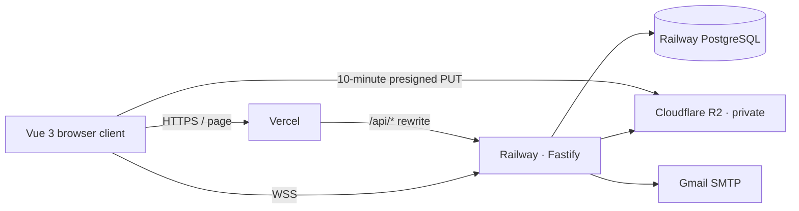

# International Chinese Platform

面向国际中文教育的公开 Beta 全栈平台。学生、教师和管理员在同一套持久化数据上完成注册、教师审核、课程、预约、实时课堂、作业、通知和对话流程。

## 当前能力

- 邮箱验证码注册、登录、退出、数据库 Session 与 HttpOnly Cookie
- 学生、教师、管理员三角色权限与资源所有权校验
- 教师资料申请、管理员审核与公开教师检索
- 课程草稿、提交、驳回、修改、发布和评价
- 师生预约、接受/拒绝、课堂创建与完成
- 作业题目、提交、评分和学生结果查看
- 通知、持久化对话、审计日志
- 一次性 WebSocket 课堂票据、聊天、在线状态和 WebRTC 信令
- PostgreSQL 编号迁移、事务和并发状态保护
- R2/MinIO 私有对象存储、直传意图、配额预留、魔数/SHA-256 校验、条件晋升和签名下载
- 一次性生产管理员初始化与首次强制改密

## 架构



Beta 阶段后端保持单实例，因为实时房间成员状态保存在进程内。前端通过 Vercel `/api/*` 代理使用第一方 Cookie；课堂 WebSocket 直接连接 Railway。

## 本地启动

要求 Node.js 24、pnpm 11、Docker Desktop / Docker Engine。

```bash
pnpm install --frozen-lockfile
docker compose up -d postgres minio minio-init
pnpm db:migrate
pnpm db:seed
pnpm dev
```

- 前端：`http://localhost:5173`
- API：`http://localhost:7777/api/v1`
- MinIO 控制台：`http://localhost:9001`

配置模板见 [`.env.example`](./.env.example)。本地和 CI 也使用 PostgreSQL，避免 SQLite/生产差异。

## 常用命令

```bash
pnpm dev                 # 前端与 API
pnpm build               # Vite 生产构建
pnpm db:migrate          # 应用未执行的编号迁移
pnpm db:seed             # 仅本地/测试演示数据
pnpm admin:bootstrap     # 创建首个生产管理员
pnpm test:api            # PostgreSQL API 集成测试
pnpm check               # lint + format + API tests + build
pnpm backup:create       # 加密 pg_dump 并上传备份 Bucket
pnpm backup:restore      # 受 CONFIRM_RESTORE 保护的恢复
```

生产配置会拒绝 `SEED_ON_START=true`，不会导入本地演示账号或课程。

## 文件安全模型

浏览器只能写入 `tmp/uploads/` 的短期 Key，并且签名绑定 Content-Type 与 Content-Length。完成接口流式检查大小、魔数和 SHA-256，并以源 ETag 为条件复制到新的 `files/` Key。正式 Key 从不签发 PUT URL，因此原上传 URL 即使被重复使用也不能覆盖已验证文件。

对象删除使用数据库 Outbox 重试；生产 R2 还应为 `tmp/` 配置 1 天生命周期兜底。私有视频和资料下载先经过 API 权限判断，再 302 到 5 分钟签名 URL。

## 健康检查

- `GET /api/v1/health`：进程存活
- `GET /api/v1/ready`：数据库不可用返回 503；R2 不可用返回 `degraded`

## 云部署

- 前端：Vercel 项目 `international-chinese-platform`
- 后端：Railway Docker 单实例
- 数据库：Railway PostgreSQL
- 文件：Cloudflare R2 私有 Bucket
- 邮件：Gmail SMTP 应用密码

完整 Secret、R2 CORS/生命周期、管理员初始化、备份、恢复和回滚步骤见[运维手册](./docs/operations.md)。架构决策见 [`docs/adr`](./docs/adr)。

## 验证

CI 使用 PostgreSQL 服务和独立 MinIO，执行源码检查、API 集成测试、生产构建与学生/教师/管理员 Playwright 工作流。文件测试覆盖伪造扩展名、配额竞争、并发完成、签名 URL 重用、ETag 条件复制和越权下载。

## 公开 Beta 边界

- 暂无 TURN；严格 NAT 环境可能无法建立音视频。
- 暂无多实例房间广播、高可用、支付、正式入学、课堂录像和外部付费 AI。
- 价格与容量当前是课程信息，不代表支付或正式席位占用。

## 主要目录

```text
src/                    Vue 3 前端
server/routes/          Fastify 领域 API
server/db/migrations/   PostgreSQL 编号迁移
server/services/        邮件、对话与对象存储适配器
server/ops/             备份与恢复
server/test/            API/数据库/安全集成测试
e2e/                    跨角色 Playwright 工作流
docs/adr/               架构决策记录
docs/operations.md      云部署与运维手册
```

安全问题请按 [`SECURITY.md`](./SECURITY.md) 私密报告，不要在公开 Issue 中披露凭据或漏洞细节。
