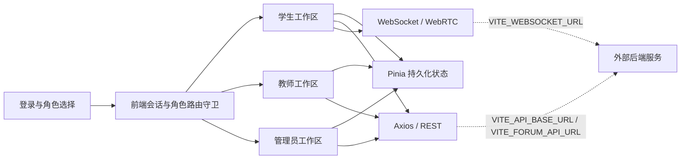

<a id="readme-top"></a>

<div align="center">
  

  <h1>🌏 International Chinese Platform</h1>

  <p><strong>面向国际中文教育的多角色教学协作平台</strong></p>
  <p>连接学生学习、教师授课、课程互动、直播课堂与数字人体验的 Vue 3 前端应用。</p>

  <p>
    <a href="#-核心功能"><strong>功能概览</strong></a>
    ·
    <a href="#-快速开始"><strong>快速开始</strong></a>
    ·
    <a href="./README.en.md"><strong>English</strong></a>
    ·
    <a href="https://github.com/computersciencefreshmen/International_Chinese_Platform/issues"><strong>问题反馈</strong></a>
  </p>

  <p>
    <a href="https://github.com/computersciencefreshmen/International_Chinese_Platform/actions/workflows/ci.yml">
      
    </a>
    
    
    
    
    
  </p>
</div>

---

## 📖 项目概览

International Chinese Platform 是一个围绕国际中文教学流程构建的多角色前端平台。它不是单页展示模板，而是将学生、教师和管理员工作区组织在同一个 Vue 3 应用中，覆盖课程发现、教师预约、学习需求发布、作业、话轮、直播课堂、数字人课堂、课程上传和平台管理等场景。

项目采用角色路由、持久化状态和统一运行时配置，将浏览器端工作流与 REST、话轮生成服务、WebSocket 信令等外部能力解耦，适合作为国际中文教育产品原型、前后端联调基座和持续演进的作品项目。

> [!IMPORTANT]
> 本仓库只包含前端应用。登录、注册、验证码、课程、教师、作业、话轮生成及实时课堂的完整生产能力仍需外部后端、信令和媒体基础设施支持。README 会明确区分“已实现的前端能力”“依赖服务的流程”和“原型功能”。

## ✨ 项目亮点

- **多角色产品结构** — 学生、教师和管理员拥有独立布局、入口、导航与角色路由守卫，而不是把所有页面堆叠在同一个工作台中。
- **覆盖教学闭环** — 从课程浏览、教师预约和学习需求，到作业、话轮、直播互动与个人中心，呈现较完整的在线中文教学路径。
- **实时与数字化教学探索** — 提供摄像头、麦克风、屏幕共享、WebRTC 信令基础、滴滴上课匹配动画和数字人课堂原型。
- **清晰的服务边界** — REST、话轮服务和 WebSocket 地址全部通过环境变量注入，并在未配置时采用安全的同源回退。
- **可持续工程基线** — 使用 pnpm 锁定依赖，配备 ESLint、Prettier、生产构建和 GitHub Actions 质量门禁。
- **可审计的仓库整合** — 三个早期仓库的有效 Git 历史已通过合并提交统一到本仓库，后续开发不再分叉。

## 🎯 核心功能

### 👨‍🎓 学生学习空间

- **课程与教师发现** — 浏览课程和教师信息，进入课程、教师详情及预约流程。
- **教师预约** — 创建预约信息，将浏览器端预约持久化，并在学生首页回显最近预约。
- **学习需求发布** — 填写学习目标、时间和偏好，形成可继续对接教师的需求草稿。
- **话轮生成** — 提交关键词并调用独立话轮服务，生成对话练习内容。
- **作业工作台** — 加载作业、保存浏览器草稿、恢复答案、校验并提交结果。
- **直播与数字人课堂** — 提供直播课堂媒体控制、滴滴上课匹配交互和数字人教学页面。
- **个人中心** — 管理个人信息、会员页面、密码入口和消息通知页面。

### 👩‍🏫 教师工作空间

- **授课工作台** — 组织教师首页、授课对接和课程管理入口。
- **网络课程与详情** — 浏览教师课程页面并进入课程详情流程。
- **课程上传原型** — 支持课程资料选择、类型与大小校验、封面预览和浏览器内课程草稿。
- **教师账户页面** — 提供教师信息与账户相关界面结构。

### 🧭 管理员工作空间

- **课程对接** — 统一查看平台课程对接入口。
- **审核中心** — 提供内容审核工作台页面结构。
- **数据中心** — 展示平台数据看板原型。
- **账户与消息** — 提供管理员密码和消息通知页面。

### ⚙️ 平台基础能力

- **角色会话与路由守卫** — 根据登录状态和角色保护学生、教师、管理员路由，并支持登录后回到原目标页面。
- **持久化状态** — 使用 Pinia 与持久化插件保存前端会话、学生资料和预约数据。
- **统一网络层** — 使用 Axios 实例、超时配置、响应错误处理和环境化服务地址。
- **实时通信基础** — 提供 WebSocket 管理以及摄像头、麦克风、屏幕共享和 WebRTC PeerConnection 封装。
- **国际化基础设施** — 集成 Vue i18n 和语言切换组件，为后续完整多语言覆盖提供基础。

## 👥 角色与入口

| 角色   | 默认入口                       | 主要任务                                               |
| ------ | ------------------------------ | ------------------------------------------------------ |
| 学生   | `/student/home`                | 课程、教师预约、需求发布、作业、话轮、直播和数字人课堂 |
| 教师   | `/teacher/home`                | 授课对接、网络课程、课程上传、课程详情和账户信息       |
| 管理员 | `/administrator/courseDocking` | 课程对接、审核、数据中心、账户和消息管理               |

所有受保护的角色路由都经过前端会话与角色检查。未登录用户会被送回 `/login`，角色不匹配时会回到当前角色的默认首页。

## 🏗️ 应用架构



运行时地址由 `src/config/runtime.js` 统一归一化。未显式设置时，REST 使用同源地址，话轮服务回退到 `/process_words`，WebSocket 根据当前页面自动选择 `ws://` 或 `wss://`。

## 📊 功能成熟度

| 能力                       | 状态        | 当前边界                                                        |
| -------------------------- | ----------- | --------------------------------------------------------------- |
| 多角色布局、路由和前端会话 | ✅ 已实现   | 生产级身份认证、授权和令牌生命周期仍由后端负责                  |
| 预约、作业和课程上传流程   | 🟡 前端流程 | 预约可本地持久化；作业依赖接口；课程上传目前保存浏览器草稿      |
| 课程、教师和管理数据       | 🟡 混合状态 | 部分页面请求接口，部分列表与管理看板仍使用静态或演示数据        |
| 直播课堂媒体控制           | 🧪 原型阶段 | 摄像头、麦克风和屏幕共享可交互；房间信令、TURN 和聊天协议待完善 |
| 数字人课堂                 | 🧪 原型阶段 | 当前为交互与教学页面原型，尚未接入真实 AI、ASR 或 TTS 服务      |
| 国际化                     | 🧪 基础设施 | 已有 Vue i18n 和语言切换，绝大多数业务文案仍以中文为主          |
| 工程质量门禁               | ✅ 已实现   | CI 覆盖安装、ESLint、Prettier 和生产构建；自动化测试待补充      |

## 🛠️ 技术栈

| 层级           | 技术                                              |
| -------------- | ------------------------------------------------- |
| 前端框架       | Vue 3.5、单文件组件（SFC）                        |
| 构建工具       | Vite 6                                            |
| 路由           | Vue Router 4、懒加载嵌套路由、角色守卫            |
| 状态管理       | Pinia、pinia-plugin-persistedstate                |
| UI 与样式      | Element Plus、Tailwind CSS 3、PostCSS、Sass       |
| 网络与实时能力 | Axios、WebSocket、WebRTC                          |
| 国际化         | Vue i18n                                          |
| 工程工具       | pnpm 8.15.9、ESLint 9、Prettier 3、GitHub Actions |

## 🚀 快速开始

### 前置要求

- Node.js `>= 18`
- pnpm `8.15.9`（已在 `package.json` 中固定）

### 1. 克隆仓库

```bash
git clone https://github.com/computersciencefreshmen/International_Chinese_Platform.git
cd International_Chinese_Platform
```

### 2. 安装依赖

```bash
corepack enable
corepack prepare pnpm@8.15.9 --activate
pnpm install --frozen-lockfile
```

### 3. 配置环境变量

```bash
cp .env.example .env.local
```

Windows PowerShell：

```powershell
Copy-Item .env.example .env.local
```

根据你的后端和信令服务修改 `.env.local`。

### 4. 启动开发服务器

```bash
pnpm dev
```

打开终端显示的本地地址，默认通常为 `http://localhost:5173`。

## 🔧 环境变量

| 变量                 | 用途                     | 未配置时的代码回退                             |
| -------------------- | ------------------------ | ---------------------------------------------- |
| `VITE_API_BASE_URL`  | REST API 根地址          | `/`（当前站点同源）                            |
| `VITE_FORUM_API_URL` | 关键词生成话轮的完整接口 | `/process_words`                               |
| `VITE_WEBSOCKET_URL` | 聊天与课堂信令 WebSocket | 当前站点的 `/websocket`，自动选择 `ws` / `wss` |

`.env.example` 提供了本地开发示例。所有以 `VITE_` 开头的变量都会进入浏览器构建产物，禁止在其中存放密码、私钥或长期有效的服务端密钥。

## 📜 常用命令

| 命令                | 说明                              |
| ------------------- | --------------------------------- |
| `pnpm dev`          | 启动 Vite 开发服务器              |
| `pnpm build`        | 生成生产构建到 `dist/`            |
| `pnpm preview`      | 本地预览生产构建                  |
| `pnpm lint`         | 自动修复可修复的 ESLint 问题      |
| `pnpm lint:check`   | 只读执行 ESLint 检查              |
| `pnpm format`       | 格式化 `src/`                     |
| `pnpm format:check` | 检查 `src/` 的 Prettier 格式      |
| `pnpm check`        | 依次执行 lint、格式检查和生产构建 |

提交代码前建议执行：

```bash
pnpm check
```

## 📁 项目结构

```text
International_Chinese_Platform/
├── .github/
│   └── workflows/ci.yml      # GitHub Actions 质量门禁
├── public/                   # 公共静态资源
├── src/
│   ├── api/                  # 学生、用户与通用 API 封装
│   ├── assets/               # 样式、图标与课程媒体
│   ├── components/           # 基础组件、领域组件与滴滴上课组件
│   ├── config/               # REST / Forum / WebSocket 运行时配置
│   ├── i18n/                 # 国际化实例与中英文词条
│   ├── router/               # 多角色嵌套路由和守卫
│   ├── stores/               # Pinia 会话、学生与管理员状态
│   ├── utils/                # Axios 与 WebSocket 工具
│   └── views/
│       ├── student/          # 学生端页面
│       ├── teacher/          # 教师端页面
│       ├── administrator/    # 管理员端页面
│       ├── liveClass/        # 直播课堂与 WebRTC 组合式函数
│       └── login/            # 登录与注册界面
├── .env.example              # 本地服务地址示例
├── package.json              # 脚本、依赖和运行时要求
├── pnpm-lock.yaml            # 可复现依赖锁文件
└── vite.config.js            # Vite 配置
```

## ✅ 质量保障

| 层级       | 门禁                                                     |
| ---------- | -------------------------------------------------------- |
| 静态质量   | ESLint 只读检查                                          |
| 格式一致性 | Prettier 检查                                            |
| 可构建性   | Vite 生产构建                                            |
| 持续集成   | Ubuntu + Node.js 20 + pnpm 8.15.9 + frozen lockfile      |
| 浏览器验证 | 关键登录、角色重定向、学生首页和数字人路由的人工冒烟检查 |

GitHub Actions 会在 Pull Request 以及推送到 `main` 时运行同一套安装、检查和构建流程。项目目前尚未配置自动化单元、组件或端到端测试，因此关键业务改动仍应补充浏览器验证。

## 🔗 仓库整合

本仓库是项目唯一的主维护仓库：

> [computersciencefreshmen/International_Chinese_Platform](https://github.com/computersciencefreshmen/International_Chinese_Platform)

项目早期代码曾分散在：

- [computersciencefreshmen/vue3-project-initialization](https://github.com/computersciencefreshmen/vue3-project-initialization)
- [computersciencefreshmen/project](https://github.com/computersciencefreshmen/project)

旧仓库的有效提交历史已通过标准 Git 合并提交进入当前 `main`，包括原本无共同祖先的初始化历史。后续代码、Issue、文档和发布均应以本仓库为准；旧仓库只作为历史参考。

## 🗺️ 路线图

- [x] 统一三个仓库历史和主维护入口
- [x] 建立学生、教师、管理员三端路由结构
- [x] 统一 REST、话轮服务和 WebSocket 运行时配置
- [x] 建立 ESLint、Prettier、生产构建和 GitHub Actions 门禁
- [ ] 对齐完整后端契约，将静态课程、教师和管理数据替换为真实数据
- [ ] 完成 WebRTC 房间、信令、TURN 和课堂聊天协议
- [ ] 接入真实数字人、AI、ASR 与 TTS 服务
- [ ] 完成全量中英文界面国际化
- [ ] 增加单元、组件和端到端自动化测试
- [ ] 补充生产部署、监控、安全基线和开源许可证

## 🚢 部署说明

```bash
pnpm build
```

生产构建输出到 `dist/`。部署时需要：

1. 在构建阶段注入正确的 `VITE_*` 环境变量。
2. 为 Vue Router history 模式配置 SPA 回退，将未知路由返回 `index.html`。
3. 使用 HTTPS，并为实时服务使用 WSS；同时正确配置后端 CORS。
4. 为生产直播课堂提供经过认证的信令服务、TURN 服务和媒体安全策略。
5. 在发布前联调登录、课程、作业、话轮和实时课堂的完整端到端流程。

## 🤝 参与贡献

欢迎通过 Issue 和 Pull Request 改进项目：

1. 从最新 `main` 创建语义清晰的功能分支。
2. 保持改动聚焦，并同步更新相关文档。
3. 提交前运行 `pnpm check`。
4. 创建 Pull Request，等待 CI 通过后使用标准合并提交并入 `main`。

## 📄 许可证

本仓库目前尚未声明开源许可证。在添加明确许可证之前，请不要假定代码已获得自由复制、分发或商用授权。

<div align="center">
  <p>Built with ❤️ for international Chinese education.</p>
  <a href="#readme-top">⬆ 回到顶部</a>
</div>
