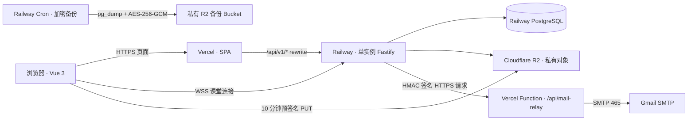

<a id="readme-top"></a>

<div align="center">
  <a href="https://github.com/computersciencefreshmen/International_Chinese_Platform">
    
  </a>

  <h1>International Chinese Platform</h1>

  <p><strong>面向国际中文教育的公开 Beta 全栈教学协作平台</strong></p>
  <p>将教师认证、课程审核、预约课堂和作业反馈连接为同一条可部署、可验证、可审计的教学闭环。</p>

  <p>
    <a href="#overview"><strong>项目概览</strong></a>
    ·
    <a href="#learning-journeys"><strong>教学闭环</strong></a>
    ·
    <a href="#quick-start"><strong>快速开始</strong></a>
    ·
    <a href="#architecture"><strong>系统架构</strong></a>
    ·
    <a href="#quality"><strong>质量证据</strong></a>
    ·
    <a href="#documentation"><strong>文档</strong></a>
    ·
    <a href="./README.en.md"><strong>English</strong></a>
  </p>

  <p>
    <a href="https://github.com/computersciencefreshmen/International_Chinese_Platform/actions/workflows/ci.yml">
      
    </a>
    
    
    
    
    
    
    
    
    
    
  </p>
</div>

---

<a id="overview"></a>

## 项目概览

International Chinese Platform 不是只展示页面的课程原型，而是一套围绕真实教学协作建模的全栈系统：学生、教师和管理员在同一份 PostgreSQL 业务数据上完成身份认证、教师认证、课程审核、预约、课堂、作业、通知与中文对话练习。

这个仓库同时包含 Vue 3 前端、Fastify 领域 API、编号迁移、私有对象存储适配、实时课堂协议、测试、部署配置与运行手册。推荐的公开 Beta 部署拓扑将前端放在 Vercel、版本化 API 放在 Railway，文件放在私有 Cloudflare R2，生产邮件经签名的 Vercel 中继投递。项目不会依赖某个版本不明的外部后端。

> [!IMPORTANT]
> <strong>完整性契约</strong>：在当前公开 Beta 的边界内，任何人都可以从本仓库安装依赖、启动 PostgreSQL 与 MinIO、迁移和导入演示数据、体验三角色流程、运行测试，并沿着文档部署核心服务。完整不等于虚构商业 LMS 能力；支付、正式选课、课堂录制、多节点实时广播和高可用被明确列为后续范围。

### 为什么值得深入阅读

- <strong>真正的业务闭环，而不是菜单堆砌</strong>：课程、预约、作业和教师认证都有服务端状态转换、权限约束、通知与审计记录。
- <strong>同一份事实数据</strong>：角色页面不是各自模拟；教师、学生和管理员都读写同一套 PostgreSQL 领域数据。
- <strong>安全边界被写进实现</strong>：会话不透明且只通过 HttpOnly Cookie 传递；写操作验证来源、角色与资源归属；文件先进入临时对象再校验并条件晋升。
- <strong>从本地到公开 Beta 的路径完整</strong>：开发环境使用 PostgreSQL + MinIO；生产架构使用 Vercel、Railway、PostgreSQL、R2 与受 HMAC 保护的邮件中继。
- <strong>诚实地表达限制</strong>：实时房间成员状态目前驻留单个 API 进程，因此公开 Beta 只运行一个后端实例；未用“高可用”或“无限扩展”掩盖这一事实。

<a id="learning-journeys"></a>

## 四条可验证的教学闭环

每条旅程都应说明一次真实操作怎样跨越角色、状态与持久化边界。下图中的四条流程也是浏览器 E2E 实际验证的核心旅程。

```mermaid
flowchart TB
  subgraph Verification["教师认证"]
    V1["教师注册 / 修改资料"] -->|进入待核验队列| V2["管理员人工核验"]
    V2 -->|批准| V3["已认证：公开展示、可被预约"]
    V3 -->|撤销或资料再次变更| V1
  end

  subgraph Course["课程审核"]
    C1["教师创建草稿"] -->|提交审核| C2["待审核"]
    C2 -->|批准| C3["已发布：学生可发现"]
    C2 -->|驳回并附理由| C4["已驳回"]
    C4 -->|修改后重提| C2
  end

  subgraph Lesson["预约与课堂"]
    L1["学生发起预约"] -->|教师接受 + 双方冲突检查| L2["已接受 + 专属课堂"]
    L1 -->|教师拒绝 / 任一方取消| L3["关闭"]
    L2 -->|时间窗内获取一次性票据| L4["聊天、在线状态、WebRTC 信令"]
    L4 -->|参与者完成课堂| L5["课堂完成"]
  end

  subgraph Assignment["作业与反馈"]
    A1["教师编写并发布"] -->|学生保存草稿| A2["学生提交"]
    A2 -->|教师评分与反馈| A3["学生查看结果"]
    A1 -->|关闭作业| A4["禁止新的写入"]
  end
```



| 旅程       | 用户能看到什么                                     | 服务端承担的关键约束                                                |
| ---------- | -------------------------------------------------- | ------------------------------------------------------------------- |
| 教师认证   | 教师资料被审核；被撤销后不再被学生发现或预约       | 管理员决定、状态冲突保护、审计与通知；资料变更自动重新待审          |
| 课程审核   | 草稿可被驳回、修改并再次提交；学生只看到已发布课程 | 教师所有权、审核状态机、发布可见性                                  |
| 预约与课堂 | 学生发起预约，教师接受后进入专属课堂               | 双方时间冲突检查、事务创建课堂、短期单用途 WebSocket 票据、房间隔离 |
| 作业与反馈 | 教师发布，学生提交，教师评分，学生看到结果         | 截止时间和关闭状态校验、提交所有权、评分结果持久化                  |

### 三个工作区

| 学生                                                                                 | 教师                                                                   | 管理员                                                       |
| ------------------------------------------------------------------------------------ | ---------------------------------------------------------------------- | ------------------------------------------------------------ |
| 发现已认证教师和已发布课程；预约课堂；提交作业；练习持久化中文对话；查看通知与评分。 | 维护专业资料；提交课程审核；处理预约；参与课堂；发布、关闭和评分作业。 | 核验教师；审核课程；查看聚合指标、审计活动与平台级工作状态。 |

<a id="quick-start"></a>

## 快速本地启动

### 前置条件

- 推荐 Node.js 24；项目支持 Node.js 22 及以上版本
- pnpm 11.9.0（由 <code>packageManager</code> 固定）
- Docker Desktop 或 Docker Engine，用于本地 PostgreSQL 与 MinIO
- 可选：Python 3.12 + Playwright Chromium，用于运行浏览器 E2E

### 1. 克隆、安装并创建本地配置

```bash
git clone https://github.com/computersciencefreshmen/International_Chinese_Platform.git
cd International_Chinese_Platform
corepack enable
pnpm install --frozen-lockfile
```

Windows PowerShell：

```powershell
Copy-Item .env.example .env.local
```

macOS / Linux：

```bash
cp .env.example .env.local
```

<code>.env.local</code> 把开发 API、PostgreSQL 和 MinIO 连接放在同一份显式配置中；无需填写 SMTP、AI 或 TURN 才能体验核心教学流程。

### 2. 启动依赖、迁移数据并导入演示内容

首次拉取镜像时，请先等待 PostgreSQL 显示为 healthy，且 <code>minio-init</code> 成功完成，再执行迁移与种子命令。

```bash
docker compose up -d postgres minio minio-init
pnpm db:migrate
pnpm db:seed
pnpm dev
```

打开以下地址：

- Web：<code>http://localhost:5173</code>
- API：<code>http://localhost:7777/api/v1</code>
- MinIO Console：<code>http://localhost:9001</code>

### 3. 验证启动成功

macOS / Linux：

```bash
curl --fail http://localhost:7777/api/v1/ready
```

Windows PowerShell：

```powershell
Invoke-RestMethod http://localhost:7777/api/v1/ready
```

如果 API 就绪，访问 Web 地址并使用下列<strong>仅限本地演示</strong>的账号登录：

| 角色   | 邮箱                             | 密码                  |
| ------ | -------------------------------- | --------------------- |
| 学生   | <code>student@example.com</code> | <code>Demo123!</code> |
| 教师   | <code>teacher@example.com</code> | <code>Demo123!</code> |
| 管理员 | <code>admin@example.com</code>   | <code>Demo123!</code> |

> 教师认证是平台管理员的人工审核，不等同于外部证书颁发方的联网真实性核验；后者仍在当前范围之外。

> [!CAUTION]
> 演示数据只能在本地或测试环境显式导入。生产配置拒绝 <code>SEED_ON_START=true</code>，<code>pnpm db:seed</code> 与 <code>pnpm db:reset</code> 也不应对生产数据库执行。

### 常用命令

```bash
pnpm dev                 # 同时启动 Vite 与 Fastify
pnpm build               # 构建生产前端
pnpm db:migrate          # 应用尚未执行的 PostgreSQL 编号迁移
pnpm db:seed             # 导入幂等演示数据（非生产）
pnpm db:reset            # 重建本地开发数据库（会删除本地 public schema）
pnpm admin:bootstrap     # 一次性创建首个生产管理员
pnpm test:api            # Node API / 数据库 / 安全测试
pnpm check               # ESLint + Prettier + API 测试 + 生产构建
pnpm backup:create       # 生产备份配置完成后，创建加密 PostgreSQL 备份
pnpm backup:restore      # 生产恢复配置完成后，受 CONFIRM_RESTORE 保护地恢复
```

<a id="architecture"></a>

## 系统架构：职责清晰，信任边界明确



本地图中，Vercel / Railway / R2 分别由 Vite、Fastify、PostgreSQL 和 MinIO 替代；应用层使用同一套 S3 接口和数据库迁移，减少“开发环境能跑、生产环境行为不同”的风险。浏览器会先向 API 申请受限上传意图，再获得临时对象的预签名 PUT；API 在完成后校验大小、魔数和 SHA-256，并仅在 ETag 条件满足时晋升到正式私有 Key。

| 组件                  | 职责                                               | 为什么这样划分                                                                      |
| --------------------- | -------------------------------------------------- | ----------------------------------------------------------------------------------- |
| Vue 3 + Vercel        | 用户界面、路由与静态资产                           | 静态内容靠近用户；仅把版本化业务 API 重写到后端，浏览器仍以第一方 Cookie 访问 API。 |
| Fastify + Railway     | 领域 API、权限判断、状态转换、WebSocket            | 将教学规则留在服务端；公开 Beta 维持单实例，避免假装已解决跨实例房间协调。          |
| PostgreSQL            | 用户、课程、预约、作业、审核、通知与审计的事实来源 | 编号迁移、事务与并发保护使跨角色流程不会依赖前端顺序。                              |
| Cloudflare R2 / MinIO | 私有文件和上传临时对象                             | 浏览器直传减少 API 传输压力；MinIO 在本地复现 S3 语义。                             |
| Vercel 邮件中继       | 持有 Gmail SMTP 凭据并投递验证码                   | Railway 只传递最小签名载荷；SMTP 密码不进入浏览器、API 环境或 Git。                 |
| Railway Backup Cron   | 导出并加密 PostgreSQL 备份                         | 备份与 API 进程职责分离；恢复仍需显式确认。                                         |

<a id="quality"></a>

## 工程可信度与质量证据

| 领域       | 实现方式                                                                              | 可验证证据                                                                                    |
| ---------- | ------------------------------------------------------------------------------------- | --------------------------------------------------------------------------------------------- |
| 身份与授权 | scrypt 密码哈希、服务端 Session 摘要、HttpOnly Cookie、来源校验、角色与资源所有权检查 | [认证测试](./server/test/auth.test.js)、[安全策略](./SECURITY.md)                             |
| 教学状态   | PostgreSQL 事务、条件更新、编号迁移、审计与通知                                       | [领域路由](./server/routes)、[迁移](./server/db/migrations)                                   |
| 私有文件   | 上传意图、临时 Key、签名绑定类型与长度、魔数/SHA-256、ETag 条件晋升、短期签名下载     | [对象存储 ADR](./docs/adr/0004-r2-object-storage.md)、[文件测试](./server/test/files.test.js) |
| 实时课堂   | 短期、单用途课堂票据；聊天室成员、历史与 WebRTC 信令按课堂隔离                        | [课堂测试](./server/test/realtime-classroom.test.js)                                          |
| 邮件边界   | Railway 对 Vercel Function 的 HMAC 请求、时间窗与严格 payload 校验                    | [邮件中继 ADR](./docs/adr/0006-vercel-hmac-mail-relay.md)                                     |
| 发布与恢复 | 健康/就绪探针、扩展型迁移、加密备份、恢复确认与回滚步骤                               | [运维手册](./docs/operations.md)                                                              |

### CI 实际验证什么

<code>pnpm check</code> 会运行 ESLint、Prettier、完整 Node API/数据库/安全测试与 Vite 生产构建。本仓库当前包含 <strong>71 个 Node 测试</strong>；GitHub Actions 还会启动隔离 PostgreSQL 和 MinIO，构建生产应用，并在真实浏览器中验证四条跨角色流程：

1. 课程“提交 → 驳回 → 修改重提 → 批准 → 学生目录可见”。
2. 预约“学生申请 → 教师接受 → 专属课堂 → 学生完成课堂”。
3. 作业“教师发布 → 学生提交 → 教师评分 → 学生查看反馈”。
4. 教师认证“管理员撤销 → 学生无法发现/预约 → 管理员重新批准 → 重新公开”。

若要本地复现浏览器 E2E，请先安装 <code>e2e/requirements.txt</code> 与 Playwright Chromium，以与 [CI 工作流](./.github/workflows/ci.yml) 相同的 PostgreSQL、MinIO 和生产环境变量启动服务，再运行 <code>python e2e/test_workflows.py</code>。查看 [Node 测试](./server/test) 与 [浏览器 E2E](./e2e/test_workflows.py)。

## 部署、运维与适用范围

推荐的公开 Beta 生产拓扑为：Vercel 托管 Vue 单页应用与邮件中继函数；Railway 托管一个 Fastify API 实例、PostgreSQL 与独立备份 Cron；Cloudflare R2 保存私有文件和加密备份。完整的 Secret、R2 CORS、迁移、管理员初始化、监控、恢复演练和回滚步骤在 [运维手册](./docs/operations.md)。

| 现在适合                                                   | 当前未覆盖                                                                                       |
| ---------------------------------------------------------- | ------------------------------------------------------------------------------------------------ |
| 课程项目、作品集展示、小规模自部署教学协作、公开 Beta 验证 | 支付结算、正式入学与席位扣减、课堂录制、外部证书 OCR/真实性核验、付费 AI、多实例实时广播、高可用 |
| 可直连或已配置 TURN 的课堂环境                             | 严格 NAT 下的可靠音视频（尚未内置 TURN）                                                         |

价格和容量目前是课程信息，并不代表支付或正式席位占用。在正式选课模型上线前，已发布课程的作业对所有登录学生可见并可提交；当前没有 roster 或 enrollment 权限层。扩展为多实例前，需要先为课堂成员状态引入跨实例广播与协调层。

<a id="documentation"></a>

## 文档地图

- [公开 Beta 运维手册](./docs/operations.md)：生产变量、R2、邮件中继、备份、恢复和回滚。
- [ADR 0003：PostgreSQL](./docs/adr/0003-postgresql-production-database.md)、[ADR 0004：R2](./docs/adr/0004-r2-object-storage.md)、[ADR 0005：Vercel / Railway](./docs/adr/0005-vercel-railway-split-deployment.md)、[ADR 0006：HMAC 邮件中继](./docs/adr/0006-vercel-hmac-mail-relay.md)：当前生产架构的关键决策。
- [历史计划](./docs/plans)：保留项目从 SQLite 原型迁移到 PostgreSQL/R2 云架构的演进记录；它们不是当前运行时配置的事实来源。
- [安全策略](./SECURITY.md)：私密披露方式、支持范围和部署安全要求。

## 主要目录

```text
src/                    Vue 3 前端与角色工作区
server/routes/          Fastify 领域 API
server/db/migrations/   PostgreSQL 编号迁移
server/services/        邮件、对话与对象存储适配器
server/ops/             备份与恢复
server/test/            API、数据库和安全集成测试
e2e/                    四条跨角色 Playwright 工作流
docs/adr/               架构决策记录
docs/operations.md      部署与运维手册
```

## 贡献、安全与许可证

欢迎以 Issue 或 Pull Request 参与改进。较大的行为变化请先说明用户旅程、服务端状态变化、测试方式与文档影响；每个 PR 应尽量让实现、测试与说明保持同步。

安全问题请按 [SECURITY.md](./SECURITY.md) 私密报告，不要在公开 Issue、截图或演示环境中泄露凭据、个人数据或漏洞细节。

本仓库当前未随附开源许可证。除适用法律明确允许的情形外，请在复用、再发布或用于生产前先取得维护者许可。

<p align="right"><a href="#readme-top">回到顶部 ↑</a></p>
